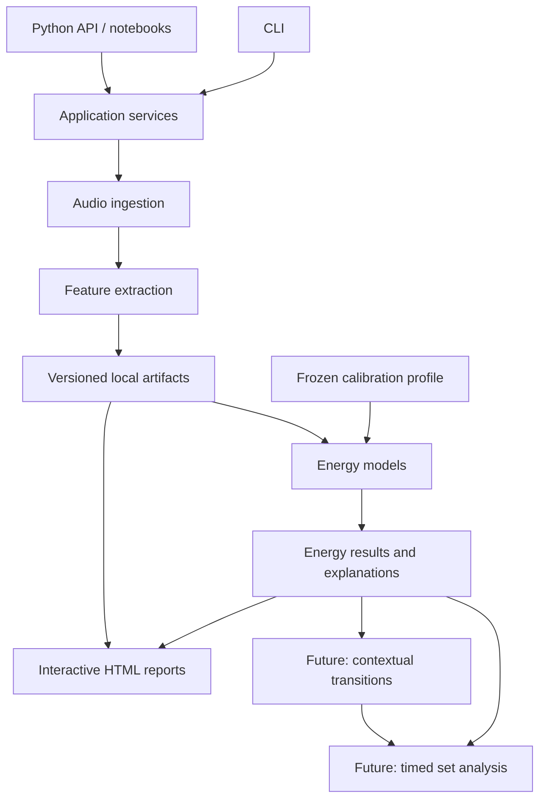

# Architecture

## Purpose and scope

Build an offline-capable Python analysis package that helps DJs inspect track energy, compare transitions, and eventually plan sets. Every score is an experimental estimate with visible inputs and provenance. Musical quality and creative judgment remain outside the model's claims.

The design starts with a Python library and CLI with interactive charts, then extends to transition and set analysis. The modules and commands below describe the planned implementation.

## Release scope

The first release still needs a defined milestone, supported operating systems, library size, audio formats, and music styles. These determine codec support, the calibration collection, and performance targets.

## Architectural decision

Start with one installable Python package with explicit module boundaries. CLI and notebook clients call the same application services. Audio decoding, numerical analysis, storage, and chart rendering sit behind narrow interfaces. Analysis and reports run locally.

## Offline operation

SetVector's core workflow runs without GPT access, API keys, hosted inference, telemetry, or network requests. Audio decoding, numerical feature extraction, calibration, energy scoring, caching, and visualization use local code and local files. Once the Python package and its dependencies are installed, normal use must work with network access blocked.

Interactive reports must embed their JavaScript so they open without a CDN. Future learned models must load from explicit local artifacts. Any hosted integration must be an optional adapter that is absent from the core dependency graph and cannot change the offline command behavior.

Installation may use a package index. A fully air-gapped installer or wheel bundle is a separate distribution task; runtime analysis cannot depend on it.



The diagram shows data flow. Code dependencies point toward shared data contracts and numerical modules; those modules must not import the CLI or chart renderer.

## Modules and responsibilities

| Module | Responsibility | Boundary |
|---|---|---|
| `domain` | Typed assets, feature series, configurations, results, and status values | No filesystem access, UI, or decoding |
| `ingestion` | Inspect files, hash content, decode audio, record source metadata | Never modify source audio |
| `analysis` | Rhythm, spectral, amplitude, harmony, and later structural measurements | Return measurements, units, timing, and quality flags |
| `energy` | Apply saved calibration, calculate experimental curves, explain contributions | Does not decode audio or fit normalization during scoring |
| `application` | Coordinate analysis, scoring, batch work, and reports | Own workflows and stage-level error handling |
| `storage` | Save/load artifacts, validate schemas, resolve cache identities | No scoring decisions |
| `visualization` | Render raw features, curves, comparison views, and provenance | Consume results without recomputing features |
| `cli` | Parse arguments, display progress, map errors to exit status | Thin adapter over application services |
| `transitions` | Later: directional comparison of specified mix regions | Requires explicit region and playback assumptions |
| `playlists` | Later: ordered playlists, timed placements, and set summaries | Preserve distinction between ordering and actual mix timing |

Use ordinary functions and typed data objects first. Add interchangeable interfaces where there is a real boundary: decoder, artifact store, feature extractor, and energy model. Avoid a general plugin framework until there are multiple implementations to support.

## Python stack

| Concern | Recommended tool | Reason and trade-off |
|---|---|---|
| Package | `pyproject.toml`, `src/setvector/` | One installable library; test the installed package |
| Numerical work | NumPy and SciPy | Array operations and signal-processing primitives |
| Music features | librosa | Provides feature and beat-analysis building blocks; interpretation and quality handling remain SetVector's responsibility |
| Decoding | SoundFile through a decoder adapter | Array-oriented audio I/O; verify requested formats on each supported platform |
| CLI | Standard-library `argparse` initially | Small dependency surface; consider Typer if command ergonomics justify it |
| Reports | Plotly HTML export | Interactive reports that can be opened locally; bundle JavaScript for offline use |
| Contracts | Dataclasses plus explicit boundary validation | Keep public types small; validate shapes, units, versions, and finite values |
| Persistence | JSON metadata plus NumPy array artifacts | Inspectable metadata without putting dense time series in JSON |
| Development | pytest, Ruff, and a reproducible dependency environment | Meaningful numerical and integration checks; pin a tested environment when scaffolding |

The choice of librosa is based on its documented [feature APIs](https://librosa.org/doc/0.11.0/feature.html) and [beat tracker](https://librosa.org/doc/0.11.0/generated/librosa.beat.beat_track.html). SoundFile documents [audio I/O and block reads](https://python-soundfile.readthedocs.io/en/latest/). Plotly supports [standalone interactive HTML](https://plotly.com/python/interactive-html-export/). The [Python Packaging guide](https://packaging.python.org/en/latest/discussions/src-layout-vs-flat-layout/) explains the import isolation provided by a `src` layout.

Select the Python version and dependency pins after a clean installation check on the target OS. Add a separate decoder backend if the required audio formats need it; report unsupported codecs clearly.

## Analysis pipeline

1. **Inspect and identify.** Check readability and supported decoding, hash file bytes, and record duration, channels, and native sample rate. Paths locate assets; content hashes identify them. Retagging a file may intentionally create a new file identity in the first version.
2. **Decode deliberately.** Preserve original levels for amplitude measurements. Derive an explicitly configured analysis signal for rhythm/spectral work. Record sample rate, resampling, channel reduction, clipping checks, and decoder version. Do not silently apply peak or loudness normalization.
3. **Measure features.** Start with a small documented set: frame RMS, spectral centroid, a defined bass-band power ratio, onset activity, and estimated tempo/beat times. Add harmony and structure when their definitions and validation are ready. RMS must be labeled as an amplitude measure; do not label it LUFS or a standardized loudness measurement.
4. **Align measurements.** Each series carries its actual timestamps, window support, and validity. Convert to an explicitly configured energy grid using a documented aggregation rule. Never assume two equal-length arrays refer to the same time instants.
5. **Persist features.** Store raw measurements before calibration. Changing weights or normalization must not require another decode/extraction run when the raw features remain compatible.
6. **Calibrate and score.** Apply a saved profile, then a versioned model. Return component contributions and missing-data flags alongside the curve.
7. **Inspect.** Export a local report with linked time axes, units, model/profile identity, and quality flags. Show raw measurements alongside the experimental interpretation.

librosa's loading defaults can resample and mix to mono, so decoding policy must be explicit rather than inherited accidentally from [library defaults](https://librosa.org/doc/0.11.0/generated/librosa.load.html). Frame centering and padding likewise need explicit treatment; see [STFT alignment](https://librosa.org/doc/0.11.0/generated/librosa.stft.html).

Keep FFT sizes, sample rates, smoothing duration, and bass-band edges in named analysis configurations and validate them against the selected music collection. Short clips, silence, variable tempo, and stereo cancellation need deliberate handling.

## Core data contracts

| Contract | Essential fields |
|---|---|
| `AudioAsset` | Content hash, source locations, duration, channels, native sample rate, file metadata |
| `AnalysisConfig` | Decode policy, feature definitions, frame/hop settings, aggregation rules, schema version |
| `AnalysisRun` | Asset ID, config hash, extractor version, dependency versions, code revision and dirty-state identity, status, diagnostics |
| `FeatureSeries` | Name, units, dimensions, values, timestamps, window start/end or support definition, validity mask |
| `FeatureBundle` | Feature ID, analysis-run provenance, series references, track summaries, beat events, feature schema version |
| `CalibrationProfile` | Profile ID, feature schema, fitting-population manifest, transforms, parameters, domain description |
| `EnergyResult` | Feature ID, calibration ID when applicable, model identity/parameters, curve, summaries, contributions, quality flags |
| `UserAnnotation` | Asset/region reference, corrected value or judgment, origin, timestamp; retain original estimates |

Use seconds relative to the start of the decoded source as the common time coordinate. Keep frame indices as implementation metadata. An invalid observation is missing, not zero. A silent passage may have valid zero amplitude but undefined spectral ratios or tempo.

Model estimates and user corrections are separate records. Corrections may affect downstream computations, so their identity must participate in downstream cache keys. A tempo candidate is not necessarily the musical pulse a DJ will use; keep ambiguity visible.

## Energy model and comparability

Maintain three distinct representations:

1. **Raw features:** physical or algorithm-specific measurements with units.
2. **Within-track dynamics:** relative changes useful for locating builds, breaks, and peaks. Label these as relative to the track.
3. **Cross-track energy:** an experimental score defined by a fixed model and calibration population. Compare only results with compatible profiles and versions.

A per-track minimum/maximum transform can make very different tracks each span 0 to 1. That representation must not be used to calculate cross-track energy differences.

Start with a transparent weighted baseline:

```text
z_i(t) = frozen_transform_i(raw_feature_i(t), calibration_profile)
E(t) = sum(weight_i * z_i(t)) / sum(weight_i)
```

For a bounded baseline, define each transform's bounded output, require nonnegative weights and a positive weight sum, and save the full configuration. Weights and transforms are hypotheses to evaluate, not established facts about musical energy. Do not assign plausible-looking default weights and present them as validated.

Keep any within-track relative baseline under a separate model identity. Cross-track scoring requires a fitted, saved profile; until one exists, expose raw feature comparisons and relative curves. Calibration fitting is a separate operation from inference and must record which tracks contributed.

Return per-feature contributions before optional smoothing. Save the smoothing method and edge policy; label which displayed curve is smoothed. Report summaries such as median and upper percentile rather than hiding all dynamics in a single score. Specify how invalid windows and silence affect summaries.

Reject incompatible or missing required features with a clear status. Do not silently change weights for individual tracks. An intentionally reduced-feature model needs its own identity and calibration.

For comparisons, require matching model, profile, and compatible feature semantics, or explicitly rescore both tracks. Different calibration populations may yield different rankings; a new profile does not overwrite old results.

## Artifact storage and execution

Suggested local workspace layout:

```text
<analysis-workspace>/
  assets/<asset-id>/asset.json
  features/<feature-id>/manifest.json
  features/<feature-id>/arrays.npz
  calibration/<profile-id>.json
  energy/<energy-id>/manifest.json
  energy/<energy-id>/arrays.npz
  reports/<report-id>.html
```

Original music stays at user-selected paths. The workspace is separate from the source repository. Reports and derived artifacts should be excluded from version control unless deliberately included as small public examples.

The feature manifest contains the bundle's canonical feature ID and analysis-run provenance. A feature ID resolves directly to `features/<feature-id>/manifest.json`; no in-memory registry or database lookup is required after restarting the CLI.

Cache identities include content hash, schema, effective configuration, extractor/model implementation identity, and relevant dependency versions. An energy cache key additionally includes calibration and annotation identities. Canonical serialization must make hashes stable. Include a source/config digest when running modified code; a Git commit hash alone cannot identify a dirty experiment.

Write into temporary artifact directories, then publish a complete artifact on the same filesystem. Validate metadata and array shapes when reading; load NumPy data without object/pickle deserialization. Incomplete writes must never count as cache hits. Refuse to overwrite an existing report unless the user supplies an explicit overwrite option.

Start with sequential per-track execution and stage-level progress. A failed file should not discard successful artifacts from a batch. Return a batch summary and nonzero CLI exit status when any requested asset fails; distinguish argument errors from processing failures. Ctrl+C should stop cleanly and preserve completed work.

No database or distributed queue is required for the first workflows. Introduce a SQLite catalog if library size and search needs warrant it. Add bounded process workers after measuring CPU and peak-memory costs on target hardware; keep decoding and temporary spectral arrays within an explicit per-job budget. Full-track loading is a starting implementation choice; long recordings may require block processing.

## Python API and CLI

Keep library entry points focused on stable artifacts:

```text
analyze_track(path, config, store) -> FeatureBundle
fit_calibration(feature_bundles, calibration_config) -> CalibrationProfile
score_track(features, model, profile) -> EnergyResult
render_track_report(features, energy, output_path) -> ReportArtifact
compare_tracks(results, comparison_config) -> ComparisonResult
```

Signatures are design sketches. Numerical functions below these services should accept arrays/contracts and return values without filesystem side effects. Calibration can initially be a Python API; it needs a public CLI command only when the workflow is established.

Proposed user commands, to implement in stages:

```text
setvector analyze "track.wav" --workspace "analysis"
setvector report <feature-id> --workspace "analysis" --output "track.html"
setvector score <feature-id> --profile <profile-id> --model <model-id> --workspace "analysis"
setvector compare <energy-id-a> <energy-id-b> --workspace "analysis" --output "comparison.html"
```

Before energy scoring exists, `report` renders raw features. Later it may accept an explicit energy result. Help output must distinguish implemented commands from future plans. Paths must work with spaces and Unicode on the supported platforms. Keep machine-readable output separate from human progress messages.

`analyze` returns/prints the feature ID accepted by `report` and `score`; `score` returns/prints the energy ID accepted by `compare`. A cache hit returns the same artifact ID. The Python contracts expose these same IDs.

## Transition and set extensions

Design extension contracts now; implement them when the corresponding milestone is selected.

**Transition:** a directional comparison of an exit region in A and an entry region in B. Include source cue ranges, playback rates, overlap length, and known gain/EQ/key-lock assumptions. Return a feature vector such as energy delta, tempo relationship, harmonic relation, and rhythmic/spectral similarity. Unknown cue or phrase positions stay unknown. A -> B and B -> A are different contexts; no universal goodness score is implied.

**Playlist:** an ordered collection of track occurrences. It can display track summaries by ordinal position, but does not define mix timing.

**Timed set plan:** explicit placements with separate occurrence IDs, source in/out points, set start times, playback-rate mappings, and overlaps. An occurrence ID allows a track to appear twice. Derive duration from these mappings and distinguish gaps, overlaps, and solo regions. An overlap-energy estimate is a provisional model, not measured mixed-audio energy.

**Recorded mix:** a new audio asset analyzed directly. Keep its measured curve separate from a predicted set-plan curve. Audio rendering, real-time DJ playback, automatic beat-grid correction, and optimized sequencing are later scopes that require their own design decisions.

## Validation

Technical correctness and musical usefulness need separate evidence:

- Generate deterministic silence, tones, impulses, and click tracks to check time alignment, dimensions, units, invalid values, and expected feature behavior.
- Check that configuration/model changes invalidate the appropriate cache layer, while weight changes reuse unchanged features.
- Test installed-package CLI paths with spaces, invalid/corrupt audio, interrupted writes, missing artifacts, and partial batch failure.
- Run an installed-package analysis with Python socket connections blocked to prevent accidental online dependencies.
- Build a small listening collection with contrastive examples and documented annotations. Store permitted metadata/annotations; use synthetic fixtures for distributable tests unless audio redistribution is authorized.
- Compare energy hypotheses with loudness-only and tempo-only baselines, feature ablations, pairwise judgments, and within-track landmarks. Report disagreement as evidence rather than smoothing it away.
- Keep evaluation tracks and recording variants out of calibration fitting. Do not split neighboring windows of the same track across fit and evaluation partitions. Follow the general [preprocessing leakage guidance](https://scikit-learn.org/stable/common_pitfalls.html).
- Define numerical tolerances for repeatability and measure elapsed time, real-time factor, peak memory, and artifact size on target hardware. Set performance targets for the intended workload.

Only introduce ML after the project has a defined target, annotations, evaluation split, and reproducible baseline. Persist model and training-data provenance. Future learned models must implement the same result contract and comparability rules.

## Scaling and future work

| Evidence or requirement | Revisit |
|---|---|
| Library search or artifact lookup becomes slow | SQLite catalog and migrations |
| Measured analysis throughput misses an agreed target | Process workers, block processing, and profiling |
| A visual local app is requested | UI adapter over the existing application API |
| Multiple users need shared libraries | Service boundary, authentication, remote storage, and job orchestration |
| Listening evidence shows the weighted model is inadequate | Alternative transforms/models with held-out evaluation |
| Reliable cue/phrase data becomes available | Region-aware transitions and timed set plans |

See [Python Library Architecture](adr/0001-library-first-architecture.md) for the design trade-offs and the [Implementation Plan](implementation-plan.md) for the build sequence.
