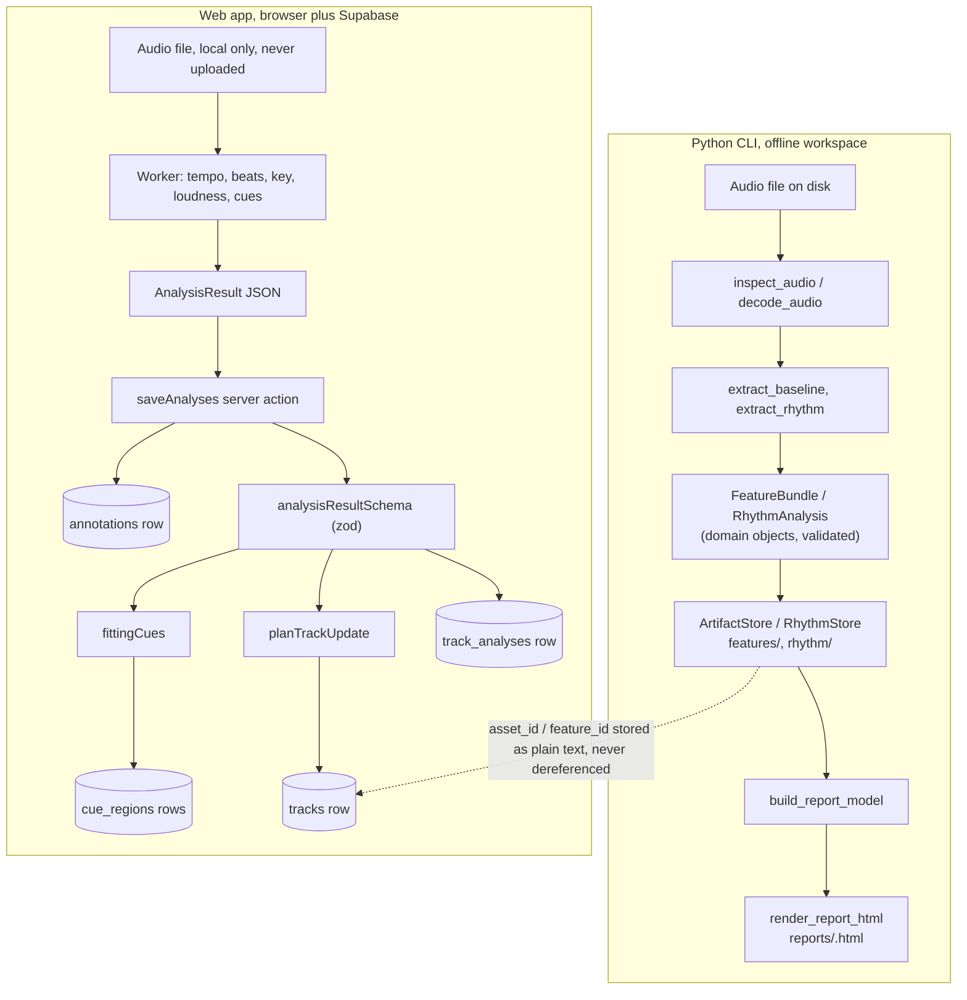

# Data and storage

SetVector has two independent storage systems that never share a database. The Python CLI (`src/setvector`) writes content-addressed JSON/NumPy artifacts to a local workspace folder and renders them into a self-contained HTML report. The web app (`web/`) runs its own TypeScript port of the analysis in the browser and stores only the resulting measurements in Supabase Postgres, under row-level security, as a mutable library with an append-only audit trail. The two sides are linked loosely: a `tracks` row can carry the CLI's `asset_id`/`feature_id` as opaque reference strings, but nothing in Postgres reads the workspace folder, and nothing in the CLI reads Supabase. Both sides share one rule: a value a person reviewed is never silently overwritten by a later automatic estimate.



## Python domain contracts

Everything the analyzer produces is an immutable, slotted `@dataclass(frozen=True)` with a `from_dict`/`to_dict` pair that round-trips through strict JSON. Construction always runs `__post_init__` validation: `require_fields` rejects any JSON object with missing or unexpected keys (no silent schema drift), and `finite_number` rejects NaN/inf everywhere a measurement is stored. There is no partially-valid object; a bad dict raises `ValueError` before a `FeatureBundle` or `RhythmAnalysis` can exist.

| Contract | Shape | Key invariants |
|---|---|---|
| `AudioAsset` | content hash, absolute path, byte size, duration, native sample rate, channels, format/subtype | `asset_id` is a lowercase 64-hex SHA-256; `observed_path` must be absolute |
| `AnalysisConfig` | sample rate (`None` = native), frame/hop length, channel policy | `hop_length <= frame_length`; has a derived `config_id` (see below) |
| `FeatureSeries` | name, unit, timestamps, values, validity mask, window start/end | arrays all the same length; timestamps strictly increasing; each timestamp inside its own window; a value is `None` exactly where `validity` is `False` |
| `AnalysisMeasurements` | four aligned `FeatureSeries` (rms, spectral_centroid, bass_power_ratio, onset_strength), `tempo_bpm`, `beats`, `diagnostics` | all four series share identical timing arrays; `tempo_bpm` is present exactly when `beats` is non-empty |
| `ExtractorIdentity` | extractor name, algorithm version, package version, `AnalysisConfig`, extra parameters, dependency versions | every field that could change the output is captured here, nothing is left implicit |
| `FeatureBundle` | `feature_id`, `asset_id`, `config_id`, `ExtractorIdentity`, `AnalysisMeasurements` | `config_id` must equal `extractor.config.config_id` |
| `GridSegment` / `CandidateQuality` / `RhythmAnalysis` | constant-tempo beat segments, the quality metrics used to accept/reject a grid candidate, and the chosen grid with provenance | `beats` must equal the concatenation of `GridSegment.times()`; `reliable` is true exactly when `source != "none"`; `setvector_fallback` grids never carry bar positions (no downbeats) |

A `RhythmAnalysis.source` is one of `beat_this`, `setvector_fallback`, or `none` — the model's own downbeat-aware grid, a local period-fitting fallback with no downbeats, or no usable grid at all. This acceptance logic itself (interval CV, grid fit, bar regularity) is the subject of [rhythm-and-beat-grid.md](rhythm-and-beat-grid.md); here it only matters that the result is a single validated, hashable record.

Code: `src/setvector/domain/bundle.py` (`FeatureBundle`, `AnalysisMeasurements`, `ExtractorIdentity`), `src/setvector/domain/rhythm.py` (`RhythmAnalysis`, `GridSegment`), `src/setvector/domain/features.py` (`FeatureSeries`), `src/setvector/domain/_validation.py` (`require_fields`, `finite_number`, `validate_version`)

## Cache identity and content hashing

Every derived artifact's identity is a SHA-256 hash of a canonical JSON payload built from *only the inputs that could change the result* — never a random UUID, never a timestamp. This is what lets `analyze_track` skip decoding audio it has already analyzed with the same configuration:

- `AnalysisConfig.config_id` — SHA-256 of the config's own `to_dict()` (sample rate, frame/hop length, channel policy).
- `feature_id = compute_feature_id(asset_id, extractor)` — SHA-256 of `{"asset_id": ..., "extractor": extractor.to_dict()}`, so it changes if the audio content, the config, the extractor algorithm/package version, or any dependency version changes.
- `rhythm_id = compute_rhythm_id(feature_id, rhythm_extractor)` — SHA-256 of `{"feature_id": ..., "extractor": ...}`, chained onto the feature identity so a rhythm result is tied to the exact baseline features it was computed from.

`asset_id` itself (produced upstream by ingestion, outside this file's scope) is a content hash of the raw file bytes, so retagging or re-encoding a file intentionally produces a new identity rather than silently reusing a stale cache entry. Note that `ArtifactStore._check_asset` compares stored vs. expected asset metadata with `observed_path` excluded — the asset identity does not care where the file currently lives, only what its bytes were when first inspected.

Because identity is computed from asset and config *before* decoding, `analyze_track` can return a fully cached `FeatureBundle`/`RhythmAnalysis` pair without touching the audio file at all when both caches hit; it only calls `decode_audio` when at least one is missing.

Code: `src/setvector/domain/config.py` (`AnalysisConfig.config_id`), `src/setvector/storage/canonical.py` (`compute_feature_id`, `compute_rhythm_id`), `src/setvector/application/analyze.py` (`analyze_track`)

## Canonical JSON

Two different JSON encodings are used for two different purposes, and the distinction matters:

- **Hashing** (`canonical_json`): sorted keys, no whitespace, UTF-8, `allow_nan=False` — a deterministic byte string fed to SHA-256 so the same logical content always hashes the same way regardless of dict insertion order.
- **Reading back** (`strict_json_loads`): parses with `object_pairs_hook` that raises on duplicate keys, and `parse_constant` that rejects `NaN`/`Infinity`/`-Infinity` literals, so a hand-edited or corrupted artifact file cannot silently load with an ambiguous or non-finite value.
- **On-disk files** (`write_json`): indented, sorted, UTF-8, also `allow_nan=False` — human-readable, but uses `strict_json_loads` to parse when read back, so the no-NaN/no-duplicate-key guarantee is enforced on every read regardless of which writer produced the file.

Config/feature/rhythm identities are always computed from `canonical_json`'s compact form, not from the indented on-disk form, so re-serializing a manifest never changes its own ID.

Code: `src/setvector/storage/canonical.py` (`canonical_json`, `strict_json_loads`), `src/setvector/storage/publish.py` (`write_json`, `read_json`)

## Artifact layout on disk

```text
<workspace>/
  assets/<asset-id>/asset.json
  features/<feature-id>/manifest.json
  features/<feature-id>/arrays.npz
  rhythm/<rhythm-id>/rhythm.json
  reports/<feature-id>.html
```

A feature manifest stores everything *except* the dense time series: extractor identity, tempo, beat positions, diagnostics, and per-series metadata that *references* array keys inside `arrays.npz` (e.g. `rms__values`, `rms__validity`). The arrays themselves — timestamps, values, validity masks, window bounds for each of the four baseline series — live in a single compressed `.npz`, loaded with `allow_pickle=False`. Invalid (missing) observations are stored as `0.0` in the array with `validity=False` alongside; the validity mask is what restores `None` on read, so a literal zero RMS value (true silence) is never confused with a missing measurement.

Every write goes through `publish_directory`: write into a fresh temporary sibling directory, then `os.replace` it onto the target path — an atomic rename on the same filesystem. If another process already published the target first, the write backs off and the existing directory is accepted instead of overwritten, *provided* it decodes to an identical bundle (`ArtifactStore.save` / `RhythmStore.save` call `_accept_existing`, which raises `ArtifactError` if the two differ — two different results can never silently share one content-addressed ID). After writing, the store immediately reads the artifact back and compares it to the in-memory object as a verification step before considering the write successful.

Reports (`write_report`) and Rekordbox XML exports use a separate, simpler atomic-write helper (`write_file`) that writes to a temp file and renames it, since those are single-file, non-content-addressed outputs that an explicit `--overwrite` flag controls rather than cache identity.

Code: `src/setvector/storage/artifacts.py` (`ArtifactStore.save`, `ArtifactStore.load`, `_encode_bundle`, `_decode_bundle`), `src/setvector/storage/rhythm.py` (`RhythmStore.save`), `src/setvector/storage/publish.py` (`publish_directory`), `src/setvector/storage/reports.py` (`write_file`, `write_report`)

## Schema versioning

Every domain contract and every on-disk manifest carries a `schema_version` integer field. `validate_version` currently accepts only the literal value `1` — there is no migration path yet, and a manifest written by a future schema-2 writer would be rejected outright by today's code rather than silently misread. Combined with `require_fields`' reject-on-unknown-or-missing-key behavior, this means the artifact format is closed: adding a field anywhere in the contract graph is a breaking change that must bump the relevant `schema_version` and will cause every artifact written under the old version to fail validation (and therefore be ignored as a cache hit, not misinterpreted).

`FeatureBundle.schema_version` and `ExtractorIdentity.schema_version` are tracked independently of the feature manifest's own `bundle_schema_version` field in `artifacts.py`, so the on-disk envelope and the domain object's own version can in principle evolve separately, though both are pinned to `1` today.

Code: `src/setvector/domain/_validation.py` (`validate_version`), `src/setvector/storage/artifacts.py` (`_MANIFEST_FIELDS`, `_decode_bundle`)

## Application workflow

`analyze_track` is the only orchestration entry point for analysis: it inspects the file, computes both cache identities up front, loads whatever is already cached, decodes the audio only if something is missing, computes the missing piece(s), and saves them. It returns an `AnalysisOutcome` carrying both cache-hit flags separately (a feature cache hit and a rhythm cache hit are independent — a config change invalidates features and rhythm together, but a *rhythm-extractor-only* change, if one existed, would invalidate just the rhythm cache).

`render_report` loads a stored bundle (and its matching rhythm analysis, if any, matched by `compute_rhythm_id`) purely from the workspace — it never re-decodes or re-extracts anything. It re-locates the source audio either from the path explicitly passed or from `asset.observed_path`, and verifies the audio it loads still hashes to the analyzed asset before embedding it; a mismatch raises a clear `InputError` rather than embedding the wrong audio.

`create_report_index` is the only part of the Python side that mutates already-published report HTML files in place: it scans a `reports/` folder for files containing SetVector's generator marker, extracts each one's embedded JSON model (`<script id="sv-model">`) by regex, builds a sortable/searchable `index.html`, and injects a "back to list" link into each report that doesn't already have one. It validates every report before writing anything, so a corrupt or foreign HTML file aborts the whole command rather than partially rewriting the folder.

Code: `src/setvector/application/analyze.py` (`analyze_track`, `AnalysisOutcome`), `src/setvector/application/report.py` (`render_report`), `src/setvector/application/report_index.py` (`create_report_index`)

## CLI commands end to end

| Command | Input | Storage effect | Output |
|---|---|---|---|
| `setvector config validate <path>` | an `AnalysisConfig` JSON file | none (read-only) | prints `config_id` and the normalized config |
| `setvector analyze <audio> --config <cfg> --workspace <dir>` | audio file path, config, workspace | writes/reuses `assets/`, `features/`, `rhythm/` | JSON with `asset_id`, `feature_id`, `rhythm_id`, cache-hit flags, downbeat count; warnings and an unreliable-grid notice go to stderr |
| `setvector report <feature-id> --workspace <dir> [--output] [--audio] [--no-audio] [--overwrite]` | a feature ID already in the workspace | writes one HTML file under `reports/` (or `--output`) | JSON with the report path and whether audio was embedded |
| `setvector report-index <collection> [--overwrite]` | a folder containing a `reports/` subfolder | rewrites each report in place (adds a back-link) and writes `index.html` | JSON with index path, report count, linked count |
| `setvector rekordbox inspect/export ...` | a Rekordbox XML export | writes a new Rekordbox-importable XML plus a JSON receipt | see [rekordbox-bridge.md](rekordbox-bridge.md) — out of scope here |

All commands print one line of machine-readable JSON to stdout on success and route warnings/errors to stderr; `_call` centralizes exit-status mapping so every command fails the same way:

| Raised | Exit behavior |
|---|---|
| `InputError` | `argparse`'s usage-error path (`parser.error(...)`, prints usage and exits 2) |
| any other `SetVectorError` | `setvector: error: <message>` to stderr, exit status 1 |
| `KeyboardInterrupt` | `setvector: interrupted` to stderr, exit status 130 |

For example, `setvector analyze track.wav --config cfg.json --workspace ./analysis` prints:

```json
{"asset_id": "…64 hex…", "feature_id": "…64 hex…", "cache_hit": false, "manifest_path": "…", "rhythm_id": "…64 hex…", "rhythm_source": "beat_this", "rhythm_reliable": true, "downbeat_count": 128}
```

`feature_id` and `rhythm_id` from this output are exactly the IDs `report` and (for `rhythm_id`) internal lookups expect; `cache_hit`/`rhythm_reliable` tell a script calling the CLI whether anything was actually recomputed or whether the grid can be trusted for downbeat-aware display.

Code: `src/setvector/cli/__init__.py` (`_run_analyze`, `_run_report`, `_run_report_index`, `_call`, `_build_parser`)

## The interactive report

`build_report_model` turns a stored `FeatureBundle` (plus an optional `RhythmAnalysis`) into a `ReportModel`: title/artist parsed from the filename (`Artist - Title` pattern), a format line, duration *derived from analyzed frame count* rather than the file header (because MP3s with oversized ID3 tags and no Xing frame can overstate duration), the four feature series base64-encoded as little-endian `float32` with `NaN` marking invalid samples, beat/downbeat times, fixed-threshold display bands for bass and brightness (explicitly labeled as display bands, not a calibrated judgment), and a `facts` table of provenance (extractor, versions, frame/hop, dependency versions, feature/asset IDs). If no rhythm analysis matches the feature artifact, or the rhythm analysis exists but isn't reliable, the model falls back to the baseline tracker's beats and adds an explicit warning string — the report never fabricates bar lines it doesn't have real downbeats for.

The model's `facts` table is what a reader actually sees under the report's provenance panel — it is built entirely from stored metadata, never recomputed: analyzed-with (package + extractor name), frame/hop size, analysis sample rate, channel policy, frames measured and unmeasured tail samples (from `AnalysisDiagnostics`), the feature ID, the asset ID, and the exact dependency versions recorded in `ExtractorIdentity.dependency_versions`. This is the report's answer to "what exactly produced this chart and can I reproduce it."

`render_report_html` assembles one offline HTML file: it inlines the uPlot charting library, the Inter font as base64 `woff2` (via `@font-face` with a restricted unicode-range split to keep size down), the report's own CSS/JS, the model JSON (escaped so it is inert inside a `<script>` tag), optional base64-encoded source audio, and bundled third-party license text — nothing the page loads comes from a CDN or network request. `report.js` then renders two uPlot line charts (RMS/bass/centroid/onset) with a scrubbable overview bar, zoom-window buttons, beat/bar gridlines drawn as custom uPlot hooks, a playhead synced to an `<audio>` element when audio is embedded, keyboard shortcuts, and a light/dark theme toggle persisted via `localStorage`. The audio-feature and rhythm-detection algorithms behind these series are covered in [audio-features-and-tempo.md](audio-features-and-tempo.md) and [rhythm-and-beat-grid.md](rhythm-and-beat-grid.md); this file only describes what data reaches the page and how.

Code: `src/setvector/visualization/model.py` (`build_report_model`, `ReportModel`), `src/setvector/visualization/html.py` (`render_report_html`), `src/setvector/visualization/assets/report.js` (`buildPlots`, `drawBeats`, `render`)

## Web: Postgres schema

The web app's schema is additive across three migrations, all under `web/supabase/migrations/`. Every table has an `owner_id` defaulting to `auth.uid()` and row-level security restricting all operations to rows the caller owns (see below).

| Table | Purpose | Notable columns |
|---|---|---|
| `profiles` | one row per `auth.users` row, created by a trigger on signup | `display_name` |
| `tracks` | the mutable library | `bpm`, `bpm_source`, `key_tonic`/`key_mode`/`key_status`, `energy`, `energy_source`, `asset_id`/`feature_id` (opaque text, validated as 64-hex when present only on the `track_analyses.asset_id` column, not constrained on `tracks`), `style_tags text[]` |
| `cue_regions` | entry/exit intervals `[start, end)` on a track | `kind`, `provenance`, `review_status`, `vocal_activity`, `analysis_id` (added in migration 3) |
| `annotations` | append-only audit log, never updated | `level`, `task`, `payload jsonb`, `revision`, `supersedes_id` |
| `crates` / `crate_tracks` | named track selections | `crate_tracks` is a join table with `position` |
| `plans` / `plan_items` | saved planner runs; `plan_items` is the editable ordered occurrence list | `plans.request`/`result` are `jsonb`; `replace_plan_items` RPC rewrites `plan_items` and `plans.result` atomically |
| `track_analyses` | one row per distinct browser-analyzer run on one audio file | `asset_id`, `analysis_key` (both 64-hex, checked by a regex constraint), `extractor jsonb`, `result jsonb`, unique on `(owner_id, analysis_key)` |

A plan deliberately keeps two representations side by side: `plans.request`/`plans.result` are opaque `jsonb` blobs (the full planner request and its scored proposal, including alternatives and comparisons — see [set-planner.md](set-planner.md)) with no column-level structure or database-side validation beyond "is valid JSON," while `plan_items` is a normal relational table with one row per ordered occurrence, foreign keys into `tracks`, and `unique(plan_id, position)`/`unique(plan_id, occurrence_id)` constraints. This split lets the UI query and reorder items relationally while still storing the planner's full scoring explanation (costs, violations, metrics) without needing a column per possible field. `replace_plan_items` is the only place both representations are written together, inside one function so they cannot drift out of sync mid-edit.

Enumerated types: `measurement_source` (`estimate`/`reviewed`), `key_status` (`unknown`/`estimated`/`reviewed`/`uncertain`/`not_meaningful`), `key_mode` (`major`/`minor`), `cue_kind` (`entry`/`exit`), `review_status` (`pending`/`approved`/`rejected`), `vocal_activity` (`unknown`/`none`/`present`), `annotation_level` (`track`/`region`/`pair`/`sequence`), `plan_mode` (`dj`/`listening`), `selection_policy` (`use_all`/`choose_from_pool`).

Database-enforced invariants worth knowing: `cue_regions` cannot reference a region past its track's duration (trigger `check_cue_bounds`), and a track's duration cannot be shortened below an existing cue region (trigger `check_track_duration_covers_cues`) — both directions of this constraint are enforced in the database, not just in the UI. `tracks_key_pair`/`tracks_bpm_source`/`tracks_energy_source` check constraints keep a value and its provenance column in lock-step (both null or both set).

Code: `web/supabase/migrations/20260925000000_setvector_init.sql` (`tracks`, `cue_regions`, `annotations`, `check_cue_bounds`), `web/supabase/migrations/20260925020000_track_analyses.sql` (`track_analyses`)

## Row-level security

Every table is `enable row level security`, and every policy follows the same shape: `using ((select auth.uid()) = owner_id)` plus, for tables with a foreign key into another owned table, a `with check (... and exists (select 1 from <parent> where ... owner_id = auth.uid()))` to stop a row being attached to someone else's parent record. `replace_plan_items` is `security invoker`, so it runs as the calling user and is still subject to RLS on every statement inside it, even though it is a privileged-looking multi-table RPC. The one `security definer` function, `handle_new_user`, is pinned with `set search_path = ''` and has `execute` revoked from `public`/`anon`/`authenticated` so it can only run as the signup trigger, never be called directly.

Code: `web/supabase/migrations/20260925000000_setvector_init.sql` (policies `"tracks are private"`, `"plan items are private"`, function `replace_plan_items`), `web/supabase/migrations/20260925010000_setvector_function_hardening.sql`

## The measurement status model

SetVector tracks *where a value came from* and *whether a person has looked at it* as separate, explicit database columns rather than inferring it — this is the concept the project most wants every reader to understand correctly.

Two different status vocabularies are used for two different kinds of field:

| Field kind | Status column(s) | Values | Why |
|---|---|---|---|
| Scalar numeric estimate (`bpm`, `energy`) | a paired `*_source` column, type `measurement_source` | `estimate` \| `reviewed` | A simple binary is enough: either nobody has confirmed the number, or someone has |
| Musical key | `key_status`, type `key_status` | `unknown` \| `estimated` \| `reviewed` \| `uncertain` \| `not_meaningful` | Key detection needs to distinguish "no evidence yet" from "the detector tried but wasn't confident" (`uncertain`) and from "a person decided this track has no single tonal center" (`not_meaningful`) — both of the latter are human or low-confidence states that a later automatic pass must not clobber |
| Cue region | `provenance` (`measurement_source`) **and** `review_status` (`pending`/`approved`/`rejected`) | — | Two independent axes: *where the suggestion came from* and *what a person decided to do about it* — a `reviewed` cue can still be `pending` review, and an `estimate` can be `approved` without changing its provenance |

The overwrite rule is enforced in application code, not the database, in exactly one place: `planTrackUpdate`. It only ever replaces `bpm`/`bpm_alternatives` when the track's current `bpmSource` is `null` or `"estimate"` — a `"reviewed"` BPM is left untouched and reported back as `kept`. For key, it only replaces `key_tonic`/`key_mode`/`key_status` when the current status is `unknown`, `estimated`, or `uncertain`; a status of `reviewed` or `not_meaningful` is left alone. A fresh estimate is always written with `*_source: "estimate"` / the detector's own `status` (`estimated` or `uncertain`), so an automatic value can never claim to be `reviewed`.

Worked through, a new analysis result interacting with each possible stored state behaves as:

| Current `bpmSource` | New tempo estimate arrives | Outcome |
|---|---|---|
| `null` (never measured) | yes | written, `bpm_source: "estimate"` |
| `estimate` | yes | overwritten with the new estimate |
| `reviewed` | yes | kept untouched; reported as `"tempo (reviewed)"` |

| Current `key_status` | New key estimate arrives | Outcome |
|---|---|---|
| `unknown` | yes | written; status becomes `estimated` or `uncertain` |
| `estimated` | yes | overwritten (another automatic attempt supersedes the last) |
| `uncertain` | yes | overwritten (still eligible for automatic revision) |
| `reviewed` | yes | kept untouched; reported as `"key (reviewed)"` |
| `not_meaningful` | yes | kept untouched; reported as `"key (marked not meaningful)"` |

`not_meaningful` is itself a human decision (a person decided the track has no single tonal center, e.g. a largely percussive or spoken-word track) and is deliberately given the same protection as `reviewed` — an automatic pass must not reinterpret that judgment as a gap to fill.

Cue suggestions follow the parallel rule in `fittingCues`: a new suggestion is dropped if an existing region of the same kind already sits within 0.5 s of it, whether that existing region was `approved` *or* `rejected` — so re-analyzing a file never re-litigates a decision the user already made, in either direction. Separately, `saveOne` deletes only cue rows that are simultaneously `estimate`, `pending`, and linked to a previous `analysis_id` before inserting new suggestions, so a user's own pending drafts or already-reviewed cues are never swept away by a re-analysis.

Analysis never writes a track's `energy` value, because the codebase has no automatic energy estimator. Energy comes from the track form or from an import. An imported value is stored as an `estimate` unless the file marks it `energy_reviewed` or `energy_source: reviewed`.

Code: `web/src/lib/analysis/apply.ts` (`planTrackUpdate`, `fittingCues`, `DUPLICATE_TOLERANCE_SECONDS`), `web/src/app/actions/analysis.ts` (`saveOne`)

## Annotations: the append-only audit trail

`annotations` is never updated or deleted by application code — every track edit, cue change, import, and analysis save calls `recordAnnotation`, which looks up the most recent annotation matching the same `level`/`task`/`track_id`/`to_track_id`/`plan_id` (and an optional `subject`, used to scope cue edits to one specific cue ID within a track), and if one exists, writes the new row with `revision = previous.revision + 1` and `supersedes_id = previous.id`. Nothing is ever overwritten in place; the current state of a field is reconstructed by following the chain, and the full history is always queryable. `track_metadata` edits only record an annotation when at least one of a fixed `REVIEWED_FIELDS` set actually changed value (after normalizing numeric strings), so saving a form with no real change doesn't pollute the log. `audio_analysis` annotations record `isEstimate: true` and a payload including the `analysis_id`, extractor name/version, and which fields were `applied` vs. `kept` — a human-readable record of exactly what the overwrite rule decided.

Code: `web/src/lib/data/annotations.ts` (`recordAnnotation`), `web/src/app/actions/tracks.ts` (`updateTrack`, `REVIEWED_FIELDS`)

## TypeScript domain types and row mapping

`web/src/lib/domain/types.ts` defines the application-level shapes (`Track`, `CueRegion`, `Annotation`, `Crate`) using camelCase and native numbers. `web/src/lib/data/rows.ts` is the only place that knows about PostgREST's snake_case row shapes and its habit of returning `numeric` columns as strings; every `to*` function (`toTrack`, `toCue`, `toAnnotation`, `toCrate`) does the snake_case-to-camelCase rename and the `Number(...)` coercion in one place, and sorts nested collections deterministically (cues by start time, crate tracks by position) so the UI never has to re-sort. `toPlannerTrack` is a second, narrower projection of `Track` built specifically for the planner's input shape (out of scope here — see [set-planner.md](set-planner.md)).

Code: `web/src/lib/domain/types.ts` (`Track`, `CueRegion`), `web/src/lib/data/rows.ts` (`toTrack`, `toCue`)

## Library import (CSV/JSON)

`parseLibrary` accepts either a JSON array (or `{"tracks": [...]}`) or a CSV with a header row, auto-detected from the first non-whitespace character. CSV parsing (`parseCsv`) is a small hand-written RFC 4180 reader (quoted fields, doubled-quote escaping, CRLF/LF). Every row is normalized independently by `normalize`: duration and cue times accept `m:ss`/`h:mm:ss`/seconds via `parseTime`, BPM and energy are range-checked (40–250, 1–10) and dropped with a problem message rather than rejecting the whole row, keys are parsed via `parseKey` (Camelot or named key) and default to `key_status: "unknown"` unless the row says `key_reviewed`, and every measurement field defaults to `measurement_source: "estimate"` unless the source file explicitly marks it `reviewed` — imported data is never assumed to be reviewed. `parseLibrary` caps input at `MAX_IMPORT_ROWS` (2500). The server action `importLibrary` then skips any row whose `asset_id` already exists in the library (deduplication against the CLI's content-addressed IDs), inserts the rest in chunks of 250, and records one `library_import` annotation summarizing the batch.

Code: `web/src/lib/import/parse.ts` (`parseLibrary`, `normalize`, `parseCsv`), `web/src/app/actions/import.ts` (`importLibrary`)

## The in-browser `AnalysisResult` shape

`web/src/lib/analysis/types.ts` defines `AnalysisResult`, the one JSON object a worker run produces and the server stores verbatim (after validation) as `track_analyses.result`. Its top-level shape:

| Field | Contents |
|---|---|
| `extractor` | name, integer version, free-form parameters, and an optional `{name, sha256}` model identity — the web analogue of the Python side's `ExtractorIdentity` |
| `durationSeconds`, `sampleRate`, `channelCount` | decode-time facts about the analyzed file |
| `tempo` | chosen BPM or `null`, its `source` (`beat_this_grid` \| `fallback_grid` \| `tempogram` \| `none`), ranked candidates, and alternative tactus rates (half/double/etc.) kept for the planner |
| `rhythm` | which tracker was `chosen`, whether the model was available, per-candidate quality/reasons, grid `segments`, `beats`, and `downbeats` (empty unless the model ran) |
| `key` (`KeyEstimate`) | tonic/mode or `null`, a `status` of `estimated` or `uncertain`, correlation, margin, voiced-share, and a ranking of alternative keys |
| `regionKeys` | the same key estimate shape, run separately over each cue region |
| `loudness` | BS.1770 integrated loudness, loudness range, sample peak, and a short-term series |
| `summary`, `boundaries`, `cues`, `waveform` | whole-track means, structural boundary candidates, cue suggestions, and a decimated peak waveform for drawing |
| `warnings` | free-text notices surfaced to the user (e.g. no model available, no reliable grid) |

This shape is deliberately the single source of truth validated by `analysisResultSchema`; nothing about *how* tempo, key, loudness, or structure are computed belongs here — see [audio-features-and-tempo.md](audio-features-and-tempo.md), [rhythm-and-beat-grid.md](rhythm-and-beat-grid.md), and [key-loudness-structure.md](key-loudness-structure.md).

Code: `web/src/lib/analysis/types.ts` (`AnalysisResult`, `ExtractorInfo`)

## Validating and applying a browser analysis result

The browser is explicitly untrusted: `web/src/lib/analysis/schema.ts`'s `analysisResultSchema` (Zod) re-validates every field of an `AnalysisResult` the client claims to have computed — ranges on tempo/key/loudness, array length caps, enum membership — before any of it is written to Postgres or used to patch a track. `saveAnalysisSchema` wraps it with the asset ID (64-hex regex), file name, title/artist, and an optional target `trackId`.

The server action `saveOne` (in `web/src/app/actions/analysis.ts`) then: resolves which track the analysis belongs to (`resolveTrack` — by explicit `trackId` with an asset-ID-mismatch guard, or by matching `asset_id`, or by creating a new track); computes an `analysisKey` as `sha256(canonical({asset_id, extractor}))`, a TypeScript analogue of the Python side's `compute_feature_id` used here to deduplicate analyzer runs via the `track_analyses` table's `unique(owner_id, analysis_key)` constraint; runs `planTrackUpdate` to decide the track patch; upserts the `track_analyses` row; applies the patch; deletes only stale pending/estimate cue suggestions tied to a previous analysis; inserts new suggestions from `fittingCues`; and records one `audio_analysis` annotation. Each item in a batch is saved independently, so one bad file in a multi-file drop does not fail the others.

Code: `web/src/lib/analysis/schema.ts` (`analysisResultSchema`, `saveAnalysisSchema`), `web/src/app/actions/analysis.ts` (`saveOne`, `resolveTrack`, `canonical`)

## Server actions, queries, and the Supabase client

Reads live in `web/src/lib/data/queries.ts` (`listTracks`, `getTrack`, `listCrates`, `listPlans`, `getLatestAnalysis`, etc.) and are plain `await`ed Supabase queries against a `ServerClient`; `listTracks` pages past PostgREST's default row cap in blocks of 1000. Writes live in `web/src/app/actions/*.ts` as Next.js Server Actions (`"use server"`), each starting with `const { supabase } = await requireUser()`, which redirects to `/login` if there is no session — so every write path is gated on auth before touching the database, in addition to RLS gating it again at the database layer. `web/src/lib/supabase/server.ts` builds the server-side client from cookies (reading cookies first deliberately marks the route dynamic, so a production build never needs Supabase credentials just to compile), and `web/src/lib/supabase/proxy.ts` (`updateSession`) runs on every request to refresh the auth cookie via `auth.getUser()` (never the unverified `getSession()`) and redirect signed-out users away from `/library`, `/crates`, `/plans`.

Code: `web/src/lib/data/queries.ts` (`listTracks`), `web/src/lib/supabase/server.ts` (`createClient`, `requireUser`), `web/src/lib/supabase/proxy.ts` (`updateSession`)

## Offline-first principles in the web app

Per `web/README.md` and the project's offline-operation rule in `AGENTS.md`/`docs/architecture.md`, the web app's own analysis path never uploads audio: files are decoded and analyzed in a Web Worker in the browser, the asset ID is computed client-side as the SHA-256 of the file bytes (the same identity scheme the CLI uses), and only the resulting `AnalysisResult` JSON — never the audio — is sent to the server, and only when the user clicks Save. The web app is explicitly optional and sits beside the offline Python path; nothing in `src/setvector` depends on it.

## Limitations and open questions

- Schema versioning in the Python artifacts has no migration path: `validate_version` accepts only `1`, so a future format change is a hard break with no documented upgrade story for existing workspaces.
- `tracks.asset_id`/`tracks.feature_id` are unconstrained free-text columns (only `track_analyses.asset_id` enforces the 64-hex pattern) — nothing stops a malformed or stale ID from being stored on a track; the only check is a per-owner uniqueness index on `(owner_id, asset_id)`.
- The Python side's `compute_feature_id`/`compute_rhythm_id` and the web side's `analysisKey` hash are conceptually the same idea (content + extractor identity to SHA-256) but are two independent implementations (`canonical_json` in Python vs. the hand-rolled `canonical()` in `web/src/app/actions/analysis.ts`) with no shared test or shared code; they are not interchangeable and a feature/rhythm ID from the CLI is never compared against an `analysis_key` from the browser.
- `web/README.md` documents that browser analysis is checked against the CLI's Python output only on synthetic fixtures (`tests/analysis`), not on real-world accuracy — this doc describes how results are stored and gated, not whether either analyzer's numbers are correct (see [audio-features-and-tempo.md](audio-features-and-tempo.md), [rhythm-and-beat-grid.md](rhythm-and-beat-grid.md), [key-loudness-structure.md](key-loudness-structure.md)).
- `cue_regions.analysis_id` is nullable and only set for analyzer-suggested cues; manually created or CSV-imported cues have no link back to any originating analysis, so the "delete stale suggestions" logic in `saveOne` only ever touches analyzer-sourced rows by construction, not by an explicit filter on origin beyond `provenance`/`review_status`.
- No automatic energy estimator exists anywhere in the codebase, Python or web. `energy` and `energy_source` are filled only by the track form or by an import, never by analysis.
