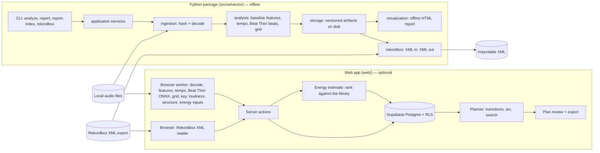

# System overview

SetVector has three parts that share ideas but not code: an offline **Python library and CLI**, an optional **web app** (Next.js and Supabase), and a **Rekordbox bridge** inside the Python package. Both the CLI and the web app turn local audio into measurements (beat grid, tempo, and so on). The web app adds key, loudness, phrase-aligned cue suggestions, an experimental energy estimate, a read-only Rekordbox import, and a set planner on top. The measurements are evidence for a DJ to review, not verdicts, and that principle explains most of the design.

## The three parts

| Part | Where it runs | Measures | Stores | Main doc |
|---|---|---|---|---|
| Python CLI and library | Your machine, offline, CPU | Baseline features, tempo, beat grid and downbeats | Content-addressed artifacts in a workspace folder (`.setvector/`), plus self-contained HTML reports | [audio-features-and-tempo.md](audio-features-and-tempo.md), [rhythm-and-beat-grid.md](rhythm-and-beat-grid.md), [data-and-storage.md](data-and-storage.md) |
| Web app: analysis | The browser's Web Worker; audio is never uploaded | Same as the CLI, plus key, loudness, section boundaries, phrase-aligned cue suggestions, energy inputs | Measurements only, in Supabase (`tracks`, `track_analyses`, `cue_regions`, `annotations`) | [key-loudness-structure.md](key-loudness-structure.md), [data-and-storage.md](data-and-storage.md) |
| Web app: energy estimate | Server-side TypeScript | — (ranks stored measurements against the library) | `tracks.energy`, marked by `energy_model` | [energy-estimate.md](energy-estimate.md) |
| Web app: Rekordbox import | XML parsed in the browser, saved by a server action | — (reads Rekordbox's grid, cues, tempo and key) | `tracks`, `rekordbox_links`, `cue_regions` | [rekordbox-bridge.md](rekordbox-bridge.md) |
| Web app: planner | Server-side TypeScript, no network calls | — (uses stored evidence) | Plans and transition judgments | [set-planner.md](set-planner.md) |
| Rekordbox bridge | Python CLI, offline | — (converts SetVector grids and cues) | A new Rekordbox XML file | [rekordbox-bridge.md](rekordbox-bridge.md) |

## Operating principles

These rules come from `AGENTS.md`, `docs/architecture.md` and the code, and they hold across every part.

1. **Offline core.** Analysis needs no GPT, API key, cloud service, telemetry or network once dependencies are installed. The Beat This! weights are bundled and hash-verified; nothing is downloaded at run time. Any hosted or language-model feature must stay optional and isolated.
2. **Estimates versus reviewed values.** Every measured value carries a provenance or status, such as `estimate` / `reviewed` for tempo and cues, or `unknown` / `estimated` / `uncertain` / `reviewed` / `not_meaningful` for key. Automatic analysis may replace missing values and earlier estimates, but **never** a value the user reviewed.
3. **Abstain rather than guess.** Algorithms report `uncertain`, `null`, or a reason string when their own checks fail: a key margin that is too small, a beat grid that fails its quality checks, a missing model. The planner treats missing evidence as a neutral cost with a `missing` flag, never as a perfect match.
4. **Diagnostics are not probabilities.** Margins, correlations, novelty strengths and planner costs are ranking heuristics. Their thresholds and weights are declared assumptions, and many are marked provisional until calibrated against reviewed data.
5. **Reproducible and content-addressed.** A track's identity is the SHA-256 of its file bytes (the *asset ID*), computed identically by the CLI and the browser. Analysis outputs are keyed by asset, configuration and extractor version, so the same input gives the same cached result. The planner is deterministic for a given seed.
6. **Never destroy user work.** The analyzer never modifies source audio. Revisions are appended to an `annotations` log rather than overwritten. The Rekordbox export never replaces existing grids or user cues. A re-analysis never re-suggests a cue the user already approved or rejected.
7. **Parallel implementations kept in step.** Rhythm analysis exists in Python (NumPy, librosa, PyTorch) and in TypeScript (hand-written DSP, ONNX Runtime Web). Parity fixtures generated from the Python code (`web/scripts/make_analysis_fixtures.py`, `make_model_reference.py`, `make_rekordbox_fixtures.py`) check that the browser port gives the same answers, and a drift test fails when the Python analyzer's versions or thresholds move past the port (`web/tests/analysis/cli-drift.test.ts`).

## Life of a track

**Through the CLI**

1. `setvector analyze track.wav --config … --workspace .setvector` hashes the file (the asset ID) and decodes it.
2. Baseline frame features are computed: RMS, spectral centroid, bass ratio and onset strength. The tempo is estimated.
3. Beat This! detects beats and downbeats. A DSP tracker is the fallback. The beats are fitted into a grid of constant-tempo segments with bar positions.
4. Arrays and JSON manifests are written as versioned artifacts; the IDs depend on the inputs.
5. `setvector report <feature-id>` renders a single offline HTML page with the audio embedded and interactive charts. `report-index` links several reports together.
6. `setvector rekordbox export` writes the grid and cues into an XML file that Rekordbox can import.

**Through the web app**

1. On **Library › Analyze audio**, the browser reads the file, computes the same SHA-256 asset ID, and decodes it with Web Audio.
2. A Web Worker runs the full analysis: features, tempo, Beat This! via ONNX (if available), grid selection, key, loudness, boundaries, phrase-aligned cue suggestions and the energy inputs.
3. A server action validates the result with a Zod schema. It stores the full JSON in `track_analyses`, writes BPM and key onto the track only where the user has not reviewed them, and inserts cue suggestions as `pending`. It then rescores the energy estimate of every track the user has not rated.
4. The user reviews values and cues in the track editor (waveform, beat markers, drag-to-resize regions). Each change is appended to `annotations`.
5. The planner builds an order from a crate or pool. It scores directional transitions (exit region of A into entry region of B), assigns cues jointly, matches the result against an energy arc, and searches for a low-cost order. Each step is explained in the plan view and can be exported as CSV or JSON.

**From Rekordbox (web app).** Instead of steps 1–3, **Library › Import › Import a Rekordbox collection** reads a collection export in the browser and adds or links tracks with Rekordbox's tempo, key, grid and cues. Cues become approved entry and exit regions; tracks without usable cues get phrase suggestions from the Rekordbox grid. Analyzing the audio later, with the imported track picked as the target, adds the browser measurements and the energy inputs.

## Where things live

| Path | Contents |
|---|---|
| `src/setvector/domain` | Typed data objects, configs, validation; no I/O |
| `src/setvector/ingestion` | Hashing, decoding, previews |
| `src/setvector/analysis` | Baseline features, rhythm engine, vendored Beat This! |
| `src/setvector/storage` | Artifact store, canonical JSON, report publishing |
| `src/setvector/application` | Workflows that tie the layers together |
| `src/setvector/visualization` | Offline HTML report (uPlot plus custom JS, assets inlined) |
| `src/setvector/rekordbox` | Rekordbox XML read, write, compare |
| `src/setvector/cli` | `argparse` front end |
| `web/src/lib/analysis` | Browser analysis pipeline and worker |
| `web/src/lib/energy` | Library-relative energy estimate |
| `web/src/lib/cues` | Phrase-aligned entry and exit suggestions, shared by analysis and Rekordbox import |
| `web/src/lib/rekordbox` | Browser XML reader, grid expansion and cue mapping for the Rekordbox import |
| `web/src/lib/library`, `web/src/lib/home` | Library filters and sorting; home dashboard statistics |
| `web/src/lib/planner` | Set planner (framework-free TypeScript) |
| `web/src/lib/domain` | Shared types, Camelot logic, formatting |
| `web/src/lib/data`, `web/src/app/actions` | Supabase queries and server actions |
| `web/supabase/migrations` | Database schema, triggers, row-level security |
| `docs/research` | Background research the planner and analysis follow |
| `docs/superpowers/specs`, `docs/superpowers/plans` | Design specs and implementation plans for each feature |

## What does not exist yet

- **Calibrated energy model.** `docs/architecture.md` plans an energy module (calibrated curves with explanations). Today the web app has an experimental, library-relative 1–10 estimate with fixed, unvalidated weights ([energy-estimate.md](energy-estimate.md)), used only where the user has no rating of their own. There are no energy curves within a track.
- **Key, loudness, structure and energy in Python.** These exist only in the web app.
- **Writing back to Rekordbox from the web app.** The web import only reads; writing XML is done by the Python bridge.
- **Transitions and playlists in Python.** The planner lives only in the web app.
