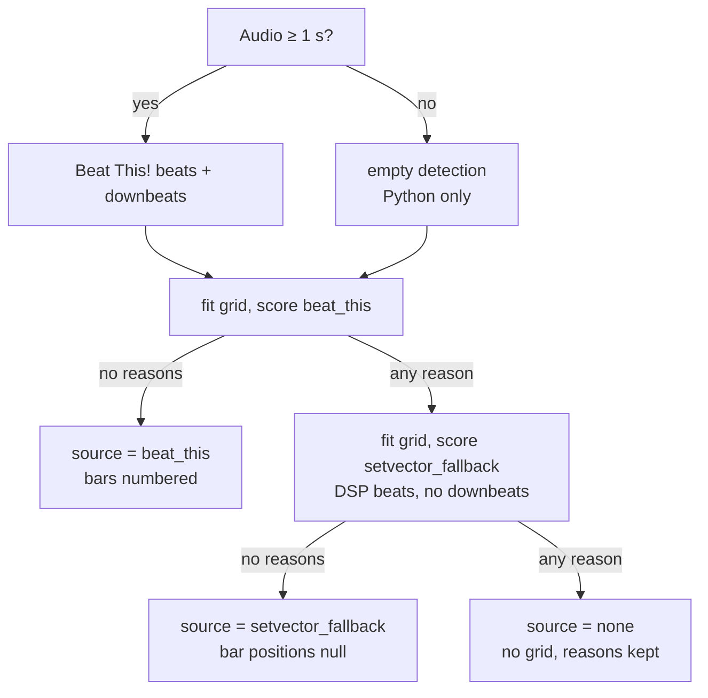

# Rhythm and beat grid

SetVector finds beats and downbeats with **Beat This!**, a pretrained transformer that reads a log-mel spectrogram and outputs, for every 20 ms frame, how likely that frame is to be a beat and a downbeat. The detected beats are then fitted to a **grid**: one or more constant-tempo segments that cover the track. The grid's tempo and bar numbering come from that fit, not from the raw detections. If the model's result fails its quality checks, the DSP beat tracker's beats are fitted and checked the same way. If both fail, the track has no grid, and the reasons are saved with the result.

The Python CLI and the web app use the same algorithm. Python runs the network in PyTorch with weights bundled in the package. The web app runs an ONNX export of the same network in a Web Worker.

## Pipeline at a glance

1. **Mix to mono** and skip detection when the audio is shorter than 1 s.
2. **Log-mel spectrogram**: resample to 22,050 Hz, then compute 128 mel bands at 50 frames per second.
3. **Beat This! network**: run it over 30-second chunks to get per-frame beat and downbeat **logits**.
4. **Peak picking**: keep local maxima with probability above 0.5, snap each downbeat to its nearest beat, and refine beat times to sub-frame precision.
5. **Grid fitting**: split the beats into up to 8 constant-tempo segments and fill the gaps between them.
6. **Candidate scoring**: compute five quality measures for `beat_this`, and reject it if any check fails. Only after a rejection, fit and score `setvector_fallback` (the DSP tracker's beats).
7. **Bar numbering**: number every grid beat 1…L from the confirmed downbeat phase (Beat This! only).
8. **Selection and BPM**: the first candidate with no rejection reasons wins. Its BPM is the tempo of the segment with the most beats.

Code: `src/setvector/analysis/rhythm.py` → `extract_rhythm`; `web/src/lib/analysis/analyze.ts` → `analyzeAudio` (stage `beats`).

---

## 1. Input and the 1-second gate

**What and why.** The network needs a single channel, so the channels are averaged. Very short audio cannot hold a meaningful beat grid, so detection is skipped below `MIN_DETECTION_SECONDS = 1.0`.

**Inputs → outputs.** Decoded channels at the source sample rate → a mono float array and its duration in seconds, $d = \text{samples} / f_s$.

- Python: `decoded.samples.mean(axis=0)`. Below 1 s, the `beat_this` candidate is still evaluated, with empty beat and downbeat arrays, so its quality and rejection reasons are recorded.
- Web: `mixToMono` (mean of channels), resampled to 22,050 Hz before detection. Below 1 s, or with no model, the `beat_this` candidate is not created at all.

Code: `rhythm.py` → `extract_rhythm`; `analyze.ts` → `analyzeAudio`.

## 2. Log-mel spectrogram (the model's input)

**What and why.** Beat This! was trained on a specific spectrogram, so this front end must reproduce it exactly. A mel spectrogram spaces frequency bands roughly the way pitch is heard. The log compresses loudness so quiet and loud passages look alike to the network.

**Inputs → outputs.** Mono samples → a `(frames, 128)` float32 matrix, with $\text{frames} = 1 + \lfloor n / 441 \rfloor$ for $n$ samples at 22,050 Hz.

| Constant | Value | Meaning |
|---|---|---|
| `SAMPLE_RATE` | 22,050 Hz | Model rate. Python resamples with soxr; web with its own Kaiser-windowed sinc |
| `N_FFT` | 1024 | STFT window (≈ 46.4 ms), periodic Hann |
| `HOP_LENGTH` | 441 | 20 ms hop, so `FPS = 50` frames/s |
| `N_MELS` | 128 | Mel bands |
| `F_MIN`, `F_MAX` | 30 Hz, 11,000 Hz | Filterbank range |
| Padding | reflect, centred | As `torch.stft(center=True, pad_mode="reflect")` |

For frame $t$ and mel band $m$:

```math
S[t,m] = \ln\!\Bigl(1 + 1000 \sum_{k=0}^{512} \frac{\lvert X_t[k]\rvert}{\sqrt{1024}}\; W[k,m]\Bigr)
```

$X_t[k]$ is the complex STFT, so the input is **magnitude**, not power. The $1/\sqrt{1024}$ factor is torch's `normalized=True`. $W$ is librosa's Slaney mel filterbank (`htk=False`, `norm=None`): triangles with peak height 1 and no area normalization. Their centres are evenly spaced on the Slaney mel scale, which is linear below 1 kHz ($m = 3f/200$) and logarithmic above it ($m = 15 + 27\ln(f/1000)/\ln 6.4$). The web code reimplements this filterbank formula. `log1p(1000·x)` behaves like $\ln x$ for loud bins and stays near 0 for silence.

Code: `beat_this/_inference.py` → `log_mel`, `_mel_filterbank`; `beat-model.ts` → `logMel`, `melFilterbank`.

## 3. The Beat This! network

**What it is.** Beat This! (Foscarin, Schlüter and Widmer, CPJKU, ISMIR 2024) is a beat and downbeat tracker built from convolutions and transformers. SetVector vendors upstream version 1.1.0 (commit `b95c8ab`, MIT license) and uses the `final0` checkpoint, which has about 20.3 M parameters. `_model.py` and `_roformer.py` are upstream files with only their imports changed, so the weight names load with `strict=True`. SetVector uses only upstream's minimal postprocessor, which has no dynamic programming and no tempo model. It picks peaks from the frame activations, and SetVector's own grid fitting (section 7) supplies the tempo structure.

**Inputs → outputs.** A chunk of shape `(1, T, 128)` with $T \le 1500$ → two logit vectors `beat[T]` and `downbeat[T]`. A logit $z$ converts to a probability with the sigmoid $p = 1/(1+e^{-z})$, so $z > 0 \iff p > 0.5$.

**Architecture**, in the order the data flows:

| Stage | What happens | Shape (channels × freq × time) |
|---|---|---|
| Stem | BatchNorm over the 128 bands, Conv2d kernel (4, 3) stride (4, 1) to 32 channels, BatchNorm, GELU | 32 × 32 × T |
| Frontend block ×3 | **Partial transformer**: attention plus feed-forward across frequency (each frame alone), then across time (each band alone). Then Conv2d kernel (2, 3) stride (2, 1) doubling channels and halving bands, BatchNorm, GELU | 64 × 16 × T → 128 × 8 × T → 256 × 4 × T |
| Flatten + linear | Concatenate 256 × 4 = 1024 features per frame, project to 512 | T × 512 |
| Transformer | 6 pre-norm blocks: 16 heads of size 32, rotary position embedding (RoPE), per-head sigmoid gate, RMSNorm, feed-forward 512 → 2048 → 512 with GELU, residual connections, final RMSNorm | T × 512 |
| SumHead | Linear 512 → 2 gives raw beat and downbeat logits; then `beat = beat + downbeat` | T × 2 |

The downbeat logit is added to the beat logit, so a downbeat also counts as a beat. Upstream's stated reason is to reduce downbeats predicted where there is no beat. Attention lets each frame look at the whole 30 s window, so the model can infer the beat from repeated patterns as well as from local onsets. Dropout is defined but inactive in `eval()` mode.

Code: `beat_this/_model.py` → `BeatThis`, `PartialFTTransformer`, `SumHead`; `beat_this/_roformer.py` → `Transformer`, `Attention`, `FeedForward`, `RMSNorm`.

## 4. Chunked inference

**What and why.** The model was trained on 1,500-frame (30 s) excerpts. A long track is processed in overlapping chunks, and predictions near chunk edges, where the model has little context, are discarded.

| Constant | Value |
|---|---|
| `CHUNK_FRAMES` | 1500 (30 s) |
| `BORDER_FRAMES` | 6 (120 ms) discarded at each chunk edge |
| step | $1500 - 2 \cdot 6 = 1488$ frames |

Chunk starts are $-6, 1482, 2970, \dots$ while start $<$ `frames − 6`. If the track is longer than one step, the last start moves to `frames − 1494`, so the last chunk ends exactly at the track's end. Chunks that extend past either end are zero-padded by up to 6 frames. Each chunk keeps only its frames 6 … T−7. Chunks run one at a time from last to first, so where two chunks overlap the **earlier** chunk's prediction wins. This matches upstream `split_predict_aggregate(overlap_mode="keep_first")`. Unfilled frames would stay at −1000. Python notes that batching chunks was no faster on CPU and doubled peak memory.

Code: `_inference.py` → `frame_logits`; `beat-model.ts` → `frameLogits`.

## 5. Peak picking and sub-frame refinement

**What and why.** This step turns frame logits into event times. It uses upstream's **minimal postprocessor**: a frame counts as a peak when it is the maximum within ±3 frames and its probability is above 0.5.

**Rule.** With `PEAK_WINDOW_FRAMES = 7`:

```math
\text{peak}(t) \iff z_t = \max_{|j|\le 3} z_{t+j} \;\wedge\; z_t > 0
```

Frames beyond the ends count as −∞. Runs of adjacent peak frames (a flat top) merge into their mean frame. Times are $t/50$ seconds. The same rule is applied separately to the beat and downbeat logits.

**Snapping downbeats.** Each downbeat is moved to its nearest beat time (ties go to the earlier beat), and duplicates are removed. Every downbeat is therefore also a beat.

**Parabolic refinement (beats only).** Frames are 20 ms apart, which is too coarse for a tight grid. For each beat at frame $k = \operatorname{round}(50\,t)$ with neighbours $y_{-1}, y_0, y_{+1}$ of the **beat logit** (not the probability):

```math
\delta = \operatorname{clip}\!\left(\frac{\tfrac12\,(y_{-1} - y_{+1})}{y_{-1} - 2y_0 + y_{+1}},\; -\tfrac12,\; \tfrac12\right),\qquad t' = \frac{k + \delta}{50}
```

This is the vertex of the parabola through the three points. It is skipped at the first and last frame, and when $y_0$ is not a strict local maximum (so merged flat tops keep their mean time). In the design spike, refinement lowered beat jitter around the fitted grid from about 8 ms to about 6 ms. Downbeats are snapped to the *unrefined* beat times, so a downbeat can differ from its refined beat by up to half a frame. Bar counting later tolerates this with a half-beat window (section 8).

Code: `_inference.py` → `_peak_frames`, `pick_peaks`; `beat_this/__init__.py` → `refine_peak_times`, `detect`; `beat-model.ts` → `peakFrames`, `pickPeaks`, `refinePeakTimes`, `detectBeats`.

## 6. Bundling and verifying the weights offline

The rule: analysis never downloads a model at run time, and it never loads unverified bytes.

**Python.**

- `scripts/fetch_model.py` is the only code that touches the network or a pickle. It downloads the upstream `final0.ckpt` and checks its plain file SHA-256 against `SOURCE_SHA256 = 8c328b45…8331`. It then loads the checkpoint with `torch.load(weights_only=True)` and writes every `model.`-prefixed tensor, with the prefix removed, to an uncompressed `beat_this-final0.npz`. Finally it checks the pinned `SHA256 = c023aa1a…93a7` and moves the file into place atomically.
- The pinned hash is a **content hash of the archive**, not of the file:

```math
H = \operatorname{SHA256}\Bigl(\,\Vert_{\,n \in \text{sorted(members)}}\; n \,\Vert\, \texttt{0x00} \,\Vert\, \text{bytes}(n)\Bigr)
```

  It ignores zip timestamps, compression and member order, so a rebuilt but identical `.npz` still matches.
- `hatch_build.py` refuses to build a wheel or sdist when the `.npz` is missing or its hash differs.
- At run time, `verify_weights` recomputes $H$ before loading. The arrays are read with `np.load(allow_pickle=False)` into a default-sized `BeatThis` using `strict=True`. The model is cached once per process (`lru_cache`). A missing, unreadable or mismatched file raises `InstallationError`; it never triggers the fallback or a download.

**Web.**

- `web/scripts/export_beat_model.py` loads the same verified `.npz`, wraps the model so it returns `(beat, downbeat)`, and exports ONNX (opset 17 by default, dynamic `frames` axis, input `spect`). It compares ONNX Runtime with PyTorch on random inputs of 1,500, 700 and 112 frames and deletes the export if the worst absolute difference exceeds `1e-3`. It writes `beat_this-final0.onnx` and a manifest `beat_this-final0.json` (`name`, `file`, `sha256` of the ONNX file bytes, `sourceWeights`, `upstream`, `opset`, `maxAbsDifference`, …) to `web/public/models/`.
- In the worker, `loadBeatModel` fetches the manifest (`cache: "no-cache"`). It optionally checks the manifest's hash against a build-time pin (`NEXT_PUBLIC_BEAT_MODEL_SHA256`), loads the model from Cache Storage (`setvector-models-v1`) or the network, and hashes the bytes with WebCrypto **every time**, including cache hits. On a mismatch it deletes a cached copy and throws. A 404 manifest means "no model published" and returns `null`.
- `createOnnxRunner` opens an ONNX Runtime Web session on the `wasm` backend (`graphOptimizationLevel: "all"`). It uses up to 4 threads when the page is cross-origin isolated, otherwise 1.

Code: `models/weights.py` → `weights_sha256`, `sha256_file`; `beat_this/__init__.py` → `verify_weights`, `load_model`; `scripts/fetch_model.py` → `main`; `web/scripts/export_beat_model.py` → `main`, `_check`; `model-loader.ts` → `loadBeatModel`; `onnx-runner.ts` → `createOnnxRunner`; `worker.ts` → `model`.

## 7. Fitting the grid

**What and why.** Detected beats jitter by a few milliseconds, and the model can miss or add a beat. DJ software expects a grid instead: tempo markers with an exactly constant period between them. The grid fitter explains the detections with as few constant-tempo **segments** as possible. This also corrects frame quantization. Beat This! times lie on a 20 ms lattice, so at 124 BPM the intervals are 0.48 s or 0.50 s, and their median of 0.48 s reads as 125 BPM. A least-squares line through all beats recovers 124.

**Inputs → outputs.** Beat times (seconds) and duration $d$ → `GridFit(segments, beats, grid_fit)`, or `None` when fewer than 2 finite unique times remain or no segment survives. Each segment emits beats at $s + nP$ for $n = 0 \dots \text{count}-1$. Its BPM is $60/P$.

| Constant | Value | Meaning |
|---|---|---|
| `GRID_TOLERANCE_SECONDS` | 0.04 | A beat within 40 ms of its grid line is an inlier |
| `GRID_ACCEPT_FRACTION` | 0.90 | A range is one tempo when ≥ 90% of its beats are inliers |
| `GRID_MIN_SPLIT_BEATS` | 32 | Each side of a split keeps ≥ 32 beats, so ranges < 64 beats never split |
| `GRID_MAX_SEGMENTS` | 8 | Maximum segments; also the maximum tidy rounds |
| `_REFITS` / `REFITS` | 5 | Robust-fit iterations |

### 7a. Reference period

```math
\Delta_j = t_{j+1} - t_j,\quad \tilde\Delta = \operatorname{median}(\Delta),\quad P_{\text{ref}} = \operatorname{mean}\{\Delta_j : |\Delta_j/\tilde\Delta - 1| < 0.25\}
```

If no interval qualifies, $P_{\text{ref}} = \tilde\Delta$. Averaging the typical intervals removes the whole-frame bias of the median.

### 7b. Initial beat indices

Each beat gets an integer index $n_i$ by counting periods from an **anchor**, the last beat that sat on the grid. The anchor starts at $(t_0, 0)$.

```math
s_i = \frac{t_i - t_a}{P_{\text{ref}}},\qquad n_i = n_a + \operatorname{round}(s_i),\qquad \text{if } |s_i - \operatorname{round}(s_i)| \le 0.25:\ (t_a, n_a) \leftarrow (t_i, n_i)
```

A missed beat makes $s_i \approx 2$, so the index skips correctly. An extra beat halfway between two beats gets an index but does not become the anchor, so later indices are not shifted. Rounding is half-to-even in both languages (the web code uses its own `roundEven`).

### 7c. Robust line

The fit runs up to 5 times: least squares of time on index over the inliers ($t \approx b + P n$), then re-index every beat with $n_i = \operatorname{round}((t_i - b)/P)$ and mark inliers with $|t_i - (b + P n_i)| \le 0.04$. The loop stops early when the inliers span fewer than 2 distinct indices or the slope is ≤ 0. If $P \le 2 \times 0.04 = 0.08$ s (above 750 BPM), every beat is marked an outlier, because such a short period would make almost anything an inlier.

### 7d. Splitting into tempo ranges

The fitter starts with one range holding all beats and processes a queue, splitting depth-first and left-first. A range is **accepted** when any of these holds:

- inlier fraction ≥ 0.90;
- it holds fewer than 64 beats;
- splitting would exceed 8 ranges: `accepted + pending + 2 > 8`.

Otherwise it is split at the index that minimizes a **truncated squared error**:

```math
C(\text{range}) = \sum_i \min\bigl(|t_i - (b + P n_i)|,\ 0.04\bigr)^2,\qquad \text{split}^* = \arg\min_{k}\ C(t_{\text{start}:k}) + C(t_{k:\text{stop}})
```

Inlier counts barely change near a tempo change, because one line through both tempos still keeps most beats within 40 ms. The capped squared error is smallest when each side holds a single tempo. The search runs over $k \in [\text{start}+32,\ \text{stop}-32]$. It is coarse-to-fine: first a stride of $\max(1, \lfloor(hi-lo)/64\rfloor)$, then every index within one stride of the coarse best. Ties keep the earliest split.

### 7e. Tidying

Greedy splitting can leave a short mixed range beside a tempo change, or a boundary a few beats off. For up to 8 rounds:

1. **Merge** left to right: join the next range onto the current one if their union's line still has ≥ 90% inliers.
2. Stop if this is not the first round and nothing merged.
3. **Re-place boundaries**: for each neighbouring pair holding ≥ 64 beats together, move their boundary to the `_best_split` optimum.

### 7f. Emitting segments

Each tidied range is refitted. A range with no inliers is dropped. Candidate beats run from the range's lowest to highest index, $c_k = b + P(n_{\min} + k)$. A segment starts at the first $c_k$ with $c_k \ge 0$ and $c_k > e_{\text{prev}} + P/2$, where $e_{\text{prev}}$ is the previous segment's last beat. It keeps every beat up to $d$; if none remain, the range is dropped. Then:

```math
\texttt{grid\_fit} = \frac{\sum_{\text{emitted ranges}} \#\text{inliers}}{\#\text{cleaned input beats}}
```

### 7g. Closing gaps

Tempo markers cannot express a hole, because a marker lasts until the next one starts. So every segment except the last is extended at its own period while $s + \text{count}\cdot P < s_{\text{next}} - P/2$. The grid is **not** extended before the first segment's first beat or after the last segment's last beat. A long beatless intro or outro stays outside the grid.

Code: `src/setvector/analysis/grid.py` → `fit_grid`, `_reference_period`, `_initial_indices`, `_fit_line`, `_ranges`, `_best_split`, `_split_cost`, `_tidy`, `_close_gaps`; `web/src/lib/analysis/grid.ts` → `fitGrid`, `referencePeriod`, `initialIndices`, `fitLine`, `splitRanges`, `bestSplit`, `splitCost`, `tidy`, `closeGaps`. Constants: `analysis/identity.py`.

## 8. Scoring a candidate

**What and why.** Each candidate's grid is measured, then compared against fixed thresholds. A candidate with any failed check gets a human-readable reason and is rejected. The fallback candidate has no downbeats, so its bar checks are skipped.

**Inputs → outputs.** Candidate name, detected beats, downbeats (or `None` for the fallback), duration → `CandidateQuality`, bar positions, and a list of reasons.

| Measure | Definition |
|---|---|
| `beat_count` | Number of finite, unique detected beats $N$ |
| `interval_cv` | Coefficient of variation of the intervals shorter than $1.5\times$ the median (see below); `null` with < 2 such intervals |
| `grid_fit` | From section 7; `null` when no grid was fitted |
| `segment_count` | Number of grid segments (0 without a grid) |
| `modal_bar_length` $L$ | Most common bar length in beats; ties go to the shorter length |
| `bar_regularity` | Fraction of bars whose length equals $L$ |

```math
\text{CV} = \frac{\sigma(\Delta')}{\mu(\Delta')},\qquad \Delta' = \{\Delta_j : \Delta_j < 1.5\,\tilde\Delta\}
```

$\sigma$ is the population standard deviation. Long intervals are missed-beat gaps, which `grid_fit` already measures. Extra detections and erratic spacing still create short intervals, so they still raise the CV.

**Bar lengths.** Each downbeat is matched to its nearest beat. The beats are the **fitted grid** beats, so a missed detection does not shorten a bar; the raw detections are used only when there is no grid. A downbeat is kept only if it lies within half the median beat interval of that beat (with a single beat, no limit applies). The sorted unique matched indices give bar lengths $\ell_j = i_{j+1} - i_j$.

**Thresholds** (all in `identity.py`, described there as "provisional until measured against reviewed Rekordbox grids"):

| Check | Rejects when | Reason string |
|---|---|---|
| `MIN_BEATS = 32` | $N < 32$ | `{name}: {N} beats, fewer than 32` |
| `MAX_INTERVAL_CV = 0.15` | CV is `null` or $> 0.15$ | `{name}: beat intervals vary too much (CV {cv})` |
| `MIN_GRID_FIT = 0.90` | `grid_fit` is `null` or $< 0.90$ | `{name}: only {grid_fit} of beats fit a steady grid` |
| downbeats present, $L$ missing | no two matched downbeats | `{name}: no bars detected` |
| `BAR_LENGTHS = (3, 4)` | $L \notin \{3, 4\}$ | `{name}: usual bar length is {L} beats, not 3 or 4` |
| `MIN_BAR_REGULARITY = 0.75` | regularity $< 0.75$ | `{name}: only {reg} of bars have {L} beats` |

Numbers in the reason strings use two decimals, and `n/a` stands in for `null`. The three bar checks are an else-if chain, so at most one bar reason appears. A value exactly on a threshold passes.

Code: `rhythm.py` → `_evaluate`, `_interval_cv`, `_bar_stats`, `_downbeat_indices`, `_nearest`; `grid.ts` → `evaluateCandidate`, `intervalCv`, `barStats`, `downbeatIndices`, `nearest`.

## 9. Bar positions

**What and why.** Every grid beat gets its position in the bar (1 = downbeat). Numbering bars directly from each detected downbeat would let a single spurious downbeat split a 4-beat bar into 1 + 3. Instead, bars follow a **phase** that changes only after several downbeats agree.

**When it runs.** Only for a candidate with downbeats and no rejection reasons, which in practice means `beat_this`. Every other grid gets `null` at every position.

**Method**, with $L$ the modal bar length and $i_j$ the grid-beat indices of the matched downbeats:

1. Phase votes: $\phi_j = i_j \bmod L$.
2. Split the votes into runs of equal consecutive phases. A run of at least `BAR_PHASE_CONFIRM = 4` is **confirmed** and takes effect from the grid index of its first downbeat.
3. If no run is confirmed, use the most common phase (smallest on ties) for the whole track.
4. The first confirmed phase applies from grid beat 0, so pickup beats before the first downbeat are numbered backwards. Each later confirmed phase that differs from the current one starts a new phase.
5. Number each grid beat by the phase $\phi$ in effect at its index $i$:

```math
\text{position}_i = \bigl((i - \phi) \bmod L\bigr) + 1
```

A lone spurious or missed downbeat changes nothing. A real inserted or dropped beat that shifts the bar for 4 or more downbeats produces exactly one short or long bar at the change. The new phase applies from the first downbeat of the confirming run, including the 3 bars before confirmation. Phases are indexed over the whole concatenated grid, not per segment.

Code: `rhythm.py` → `_bar_positions`; `grid.ts` → `barPositions`.

## 10. Candidate selection and final BPM



- The fallback is evaluated **only** when `beat_this` was rejected, so `quality` holds one or two entries, and `reasons` concatenates every evaluated candidate's reasons in order.
- The fallback beats come from the DSP tracker on the bass-band onset envelope. See [audio-features-and-tempo.md](audio-features-and-tempo.md). Python reads them from the stored baseline features (`bundle.measurements.beats`); the web app runs `trackBeats` in the same worker.
- If `beat_this`'s beats are good but its downbeats fail a bar check, the whole candidate is rejected. There is no "beats-only Beat This!" grid.

**Final BPM.** The tempo of the segment covering the most beats (the first such segment on ties):

```math
\text{BPM} = \frac{60}{P_{s^*}},\qquad s^* = \arg\max_s \text{beat\_count}_s
```

It comes from a least-squares fit over many beats, so it is usually not a round number such as 124.00. No half- or double-time folding is applied.

**Python output** (`RhythmAnalysis`): `source` ∈ {`beat_this`, `setvector_fallback`, `none`}. It also holds `grid_segments` (`start_seconds`, `bpm`, `beat_count`, `first_bar_position` = position of the segment's first beat) and `beats`, regenerated from the segments as $s + n \cdot 60/\text{bpm}$. Further fields are `bar_positions`, `detected_beats` (the winner's refined detections before fitting), `tempo_bpm`, `quality`, `reliable` (true exactly when `source ≠ none`) and `reasons`. Validation enforces: positions all known or all null; none for the fallback; `tempo_bpm` equal to the longest segment's BPM; no grid, detections or tempo when `source = none`. Downbeats are derived as the beats at position 1. Storage is covered in [data-and-storage.md](data-and-storage.md), and Rekordbox export of the grid in [rekordbox-bridge.md](rekordbox-bridge.md).

**Web output** (`AnalysisResult`):

- `tempo.bpm` rounded to 0.01. `tempo.source` is `beat_this_grid`, `fallback_grid`, `tempogram` (no grid, so the BPM falls back to the tempogram estimate, with a warning) or `none`.
- `tempo.alternatives`: up to 4 values from $[2\cdot\text{BPM},\ \text{BPM}/2,\ \text{tempogram peaks}]$ that lie in 40–250 BPM and differ from BPM by more than $|\log_2(b/\text{BPM})| > 0.03$, rounded to 0.01.
- `rhythm`: `chosen`, `modelAvailable`, `reasons`, `candidates`, and `segments` (`startSeconds`, `period`, `beatCount`). It also holds `beats` and `downbeats` rounded to 1 ms.

Code: `rhythm.py` → `extract_rhythm`; `domain/rhythm.py` → `RhythmAnalysis`, `GridSegment`, `CandidateQuality`; `analyze.ts` → `analyzeAudio`; `grid.ts` → `segmentBpm`.

---

## Python vs web

| Aspect | Python CLI | Web worker |
|---|---|---|
| Network runtime | Vendored PyTorch model | ONNX Runtime Web (`wasm`), exported from the same weights, ≤ 1e-3 logit difference on export checks |
| Weights file | `beat_this-final0.npz` inside the package | `beat_this-final0.onnx` plus JSON manifest under `/models/`, produced by the export script (the `.onnx` is gitignored) |
| Integrity check | Content hash over sorted `.npz` members, pinned in `weights.py`; build fails if wrong | Plain SHA-256 of the ONNX bytes against the manifest, optional pin via `NEXT_PUBLIC_BEAT_MODEL_SHA256`; re-checked on every load |
| Model missing or bad | `InstallationError`: analysis stops | Missing manifest: warning, fallback only. Failed verification: warning, fallback only |
| Inference error | `AnalysisError`: analysis stops (by design, so defects are not hidden) | Warning, fallback used |
| Audio < 1 s | `beat_this` evaluated with empty detection and recorded with reasons | `beat_this` candidate absent |
| Resampler to 22,050 Hz | soxr | Kaiser-windowed sinc (`resample.ts`); not bit-identical |
| STFT | `torch.stft` | Own radix-2 FFT, periodic Hann, same reflect padding and scaling |
| Line fit | `np.polyfit` | Closed-form least squares |
| Rounding | Python `round` / `np.round` (half-to-even) | `roundEven` in grid fitting; `Math.round` in peak refinement (half-up; no effect in practice, because half-frame times come from flat tops that are not refined) |
| Fallback beats | Stored baseline `measurements.beats` | `trackBeats` port on `beatOnset` |
| No reliable grid | `tempo_bpm = null` | BPM from the tempogram, `source = "tempogram"` |
| Detected beats kept | Yes (`detected_beats`) | No |
| Precision of output | Full floats | Beats and downbeats to 1 ms, BPM to 0.01 |
| Thresholds | `analysis/identity.py`, recorded in the extractor identity (changing one changes `rhythm_id`) | Duplicated as constants in `grid.ts` |

---

## Limitations and open questions

- **Provisional thresholds.** `MIN_BEATS`, `MAX_INTERVAL_CV`, `MIN_GRID_FIT`, `MIN_BAR_REGULARITY` and the grid constants were set from a three-track spike. They still need to be checked against reviewed Rekordbox grids. The web copies in `grid.ts` must be kept in step by hand.
- **Absolute phase.** The grid sits wherever Beat This! puts the beats. Whether that is on the kick attack, or needs a global offset, has not been measured.
- **Near-equal tempos merge.** A range is accepted at 90% inliers within 40 ms, so sections whose tempos differ by about 0.2 BPM or less can share one averaged segment, with outer beats up to about 50 ms off.
- **Continuous drift.** Grid fitting assumes piecewise-constant tempo. Live drums or rubato either split into up to 8 segments or fail `grid_fit` and fall back.
- **No beats-only Beat This! grid.** If the downbeats fail a bar check, the Beat This! beats are discarded too, even when they are good.
- **Fallback has no bars.** A `setvector_fallback` grid has `null` bar positions, so anything that needs downbeats cannot use it. The web app's cue suggestions still use its beats, every 32 beats from the first beat, labelled "bar phase unknown" ([key-loudness-structure.md](key-loudness-structure.md)).
- **Metrical level.** The BPM follows the model's metrical level. Half- and double-time readings are not folded into a preferred range; the web app only lists ×2 and ÷2 as alternatives.
- **Bar phase across a gap.** A new segment after a detection gap keeps the previous bar phase until 4 downbeats confirm a new one. A segment that restarts mid-bar can therefore show one short bar and a wrong `first_bar_position`.
- **Short phase shifts are ignored.** A bar shift lasting fewer than 4 downbeats is treated as detector noise.
- **Grid stops at the detections.** No beats are extrapolated before the first or after the last detected beat. Beatless intros and outros are off the grid.
- **Known failure mode.** In the spike, the model failed on an acapella (about 65 BPM, erratic bars). That track was correctly rejected by `grid_fit` and the bar checks.
- **Web vs Python parity.** The resampler and FFT differ, so logits and therefore peak frames can differ slightly between the two. No cross-implementation parity test is described in these files.
- **Vendored code.** Upstream fixes to Beat This! are not picked up automatically.
