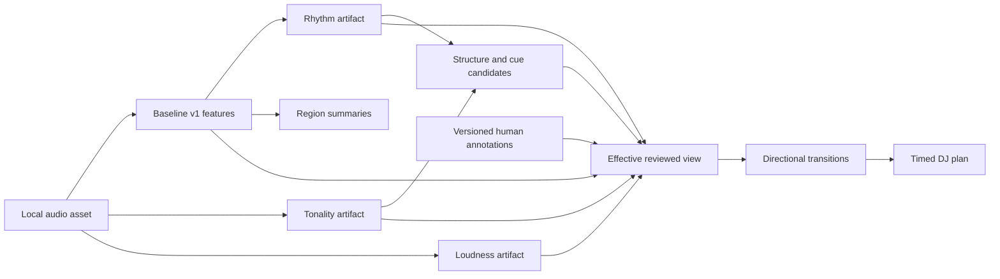

# Extending Track Analysis for Playlist Planning

## Purpose

The first useful planner prepares a DJ set from 200–2,000 local tracks, lasting 1–3 hours, across House, Hip-hop, Pop, EDM, BollyHouse, and Bollywood. It must reorder a supplied crate or select from a larger library, return an order and reviewable transition suggestions, and work offline. Manually confirmed keys and cues can drive the first version. The later listening-flow mode shares the library and search machinery but needs a different playback and scoring profile. This document examines how to add the missing measurements to the [existing analysis pipeline](../architecture.md#analysis-pipeline); the [implementation plan](../implementation-plan.md) defines the build order.

## What the analyzer currently provides

`analyze_track` inspects a file, computes a content and extractor identity, reuses a valid cached artifact, or decodes and persists baseline measurements. `extract_baseline` emits RMS amplitude, spectral centroid, bass power ratio, within-track peak-normalized onset strength, one tempo estimate, and beat positions. Frames are left aligned, with source-relative timestamps at frame centers and an omitted partial tail. The CLI currently accepts one audio file per `analyze` invocation. [Application service](../../src/setvector/application/analyze.py) · [Baseline extractor](../../src/setvector/analysis/baseline.py) · [CLI](../../src/setvector/cli/__init__.py)

The current `AnalysisMeasurements` contract requires exactly four scalar series on the same time grid. `FeatureSeries` allows only one-dimensional values. The artifact reader enforces exact manifest and NPZ keys and one-dimensional arrays; the version validator accepts only version 1. Adding chroma, alternative beat grids, or section intervals to that artifact in place would invalidate its identity and old readers. [Bundle contract](../../src/setvector/domain/bundle.py) · [Scalar series](../../src/setvector/domain/features.py) · [Artifact codec](../../src/setvector/storage/artifacts.py) · [Version validator](../../src/setvector/domain/_validation.py)

The baseline's onset series is divided by each track's own maximum. It can show relative activity within a track, but its value is not directly comparable between tracks. RMS is linear sample amplitude, not a standardized loudness or perceived-energy score. `librosa.beat.beat_track` is given a single global tempo estimate; neither its output nor the saved beat grid contains a reliability estimate, meter, downbeat phase, or half/double-time alternatives. [Baseline extractor](../../src/setvector/analysis/baseline.py) · [librosa beat tracker](https://librosa.org/doc/0.11.0/generated/librosa.beat.beat_track.html)

## Extension boundary

Preserve the version-1 baseline artifact and its exact reader. Add separately versioned **derived analysis families** for rhythm, tonality, structure/cues, and loudness. Each family has its own effective configuration, extractor identity, manifest, typed events or arrays, and cache ID. A result records the source asset ID and every input artifact ID it actually consumes. It should not inherit an unrelated feature ID merely because that feature happened to be computed first. A new extractor identity includes algorithm version, effective parameters, dependency versions, and a code or model digest; package version alone does not identify a modified local algorithm. The artifact store should retain atomic publication, readback verification, strict shape and dtype checks, and `allow_pickle=False`. Keep version dispatch in the new codecs instead of making every version globally acceptable.

Raw estimates and human corrections stay separate. A corrected cue, beat grid, or key changes the identity of the effective reviewed view and downstream transition/plan artifacts, not the raw audio measurements. Record an annotation revision and its superseded predecessor; reject intervals outside the asset duration. The asset ID hashes whole file bytes, so a metadata retag can create a new asset ID. Library records should hold mutable paths, artist/style tags, remix relationships, and an explicit identity-link decision; they should not rewrite immutable `asset.json` or feature artifacts. [Artifact identity](../../src/setvector/storage/canonical.py) · [Ingestion](../../src/setvector/ingestion/audio.py)

For the first library, wrap the existing one-track service in sequential batch orchestration. `decode_audio` loads the entire waveform and `DecodedAudio` makes a copy, even though the FFT and tempogram stages use bounded chunks. Parallel workers are a later choice after measuring peak memory and throughput. Cache hits should avoid decoding, and a failed track should not discard successful artifacts. A simple manifest/index can enumerate candidates; SQLite is justified by measured lookup and update needs, not by library size alone. [Decoder](../../src/setvector/ingestion/audio.py) · [Batch guidance](../implementation-plan.md#5-library-preparation-and-region-summaries)

## Region summaries before automatic detection

A transition compares source intervals, not whole-track averages. Define a pure `summarize_region(feature_bundle, start_seconds, end_seconds)` operation for half-open intervals `[start, end)`. Clip each feature's real window support to that interval; use intersection duration for a weighted value summary and compute **valid coverage** from the union of valid clipped supports so overlapping windows do not inflate it. Report both value and coverage, plus invalid and uncovered spans. A valid silent frame remains zero; an undefined spectral ratio remains missing. Report the omitted tail as uncovered if a cue reaches it. Reject mismatched feature configurations rather than averaging incompatible measurements.

This yields an immediate reviewed-cue prototype using existing RMS, centroid, bass ratio, and relative onset. It does **not** turn those values into a cross-track energy score. Transition contracts should expose the raw component differences, unknown key/beat/phrase evidence, source regions, playback rates, overlap, cut/blend type, gain/EQ and key-lock assumptions. The timed plan must check a middle track's selected entry and exit together and calculate elapsed time from played spans and overlaps. [Transition research](harmonic-and-transition-research.md) · [Playlist research](playlist-creation-engine.md)

## Candidate analysis methods

| Missing evidence | First offline candidate | Persist and evaluate | Important limit |
|---|---|---|---|
| Pulse alternatives and stability | Reuse the baseline onset envelope; inspect local autocorrelation/tempogram peaks and try half/double-time candidates. Compare beat interval drift and onset alignment. `librosa.feature.tempo(..., aggregate=None)` provides a local-tempo baseline. [librosa tempo](https://librosa.org/doc/0.11.0/generated/librosa.feature.tempo.html) · [dynamic-beat example](https://librosa.org/doc/latest/auto_tutorials/03-advanced/plot_dynamic_beat.html) | Candidate BPMs, local tempo curve, beat-event times, estimator-strength diagnostics, accepted or unknown tactus. Test click tracks, variable tempo, and held-out annotated excerpts. | A peak strength or regularity statistic is not a calibrated probability of a correct beat grid. Half/double time can be musically ambiguous. |
| Downbeat and meter | Start from manually reviewed anchors. Research an offline downbeat detector only after a corpus pilot; do not mark every fourth beat as detected. | Meter/downbeat candidates, their timing and provenance; separate beat and downbeat error and abstention rates. | A reliable beat sequence does not establish bar phase or phrase length. |
| Local tonality | Compute 12-bin CQT chroma, preferably comparing raw and harmonic-emphasized audio; aggregate over a declared tonal window and rank major/minor templates. [librosa chroma](https://librosa.org/doc/0.11.0/generated/librosa.feature.chroma_cqt.html) · [HPSS](https://librosa.org/doc/0.11.0/generated/librosa.effects.hpss.html) | Timestamped 12×T matrix, tuning/configuration, candidate tonic/mode rankings, top-candidate margin, low-tonality/unknown state, reviewed corrections. | Column-normalized chroma is not loudness. Template margin is not a probability. Local modulation, sparse harmony, and non-major/minor passages may make one Camelot label inappropriate. |
| Section and cue candidates | Derive novelty and contiguous boundaries from downsampled chroma/rhythm/timbre, then rank candidate entry/exit regions using spacing, stable pulse, vocals and available playing span. `librosa.segment.agglomerative` and recurrence tools can supply exploratory boundaries. [librosa segmentation](https://librosa.org/doc/0.11.0/generated/librosa.segment.agglomerative.html) · [recurrence matrix](https://librosa.org/doc/0.11.0/generated/librosa.segment.recurrence_matrix.html) | Boundary time, evidence, candidate region, label such as `section_boundary_candidate`, and review status. | A segment boundary is not a verified phrase, drop, or safe mix point. Full dense recurrence scales quadratically with time frames; reduce resolution or use sparse methods before library-wide use. |
| Percussive and vocal activity | Use defined onset/bass and HPSS percussive measurements as hypotheses for rhythmic activity. Annotate vocals manually for the first cue pilot; evaluate any later vocal model separately. [librosa HPSS](https://librosa.org/doc/0.11.0/generated/librosa.effects.hpss.html) | Windowed activity values, units or normalization, detection coverage, and false-positive slices by style. | HPSS separates harmonic/percussive components; it does not identify vocals. Do not relabel a proxy as vocal presence. |
| Loudness and dynamics | Preserve the decoded channel layout and original level. Evaluate a pinned ITU-R BS.1770 / EBU R 128 meter such as `pyloudnorm`; record the exact standard revision it implements and verify it against reference signals. Measure local variation separately. [ITU-R BS.1770-5](https://www.itu.int/rec/R-REC-BS.1770-5-202311-I) · [EBU R 128](https://tech.ebu.ch/publications/r128) · [pyloudnorm](https://github.com/csteinmetz1/pyloudnorm) | Channel policy, integrated LUFS where defined, local loudness windows with support and gating status, dynamics descriptor, meter version. Compare to reference signals and an independent meter. | LUFS is a standardized loudness measurement, not a sufficient model of excitement or dance-floor energy. Mono mixdown before metering can change the result; independently gated short clips must not be labeled momentary loudness. |

Use the installed librosa version in `pyproject.toml` when implementing these candidates, with explicit sample rate, hop length, centering, channel policy, and time conversion. A newer documentation example is research context, not an instruction to upgrade the dependency. Alternative libraries and pretrained models can be benchmarks if their exact package/weight licenses, offline availability, runtime memory, and per-style quality are established. Core analysis must not download weights during normal use. [Project dependencies](../../pyproject.toml) · [Offline architecture](../architecture.md#offline-operation)

[Beat This!](https://github.com/CPJKU/beat_this) is SetVector's required beat and downbeat detector: its inference code is vendored into the package and its `final0` weights ship as a hash-verified `.npz`, with PyTorch as a core dependency, as detailed in the [Rhythm Engine Design](../superpowers/specs/2026-09-23-rhythm-engine-design.md). [Essentia RhythmExtractor2013](https://essentia.upf.edu/reference/std_RhythmExtractor2013.html) and [KeyExtractor](https://essentia.upf.edu/reference/std_KeyExtractor.html) are comparison implementations, subject to input-rate, package, and model-license checks. Their outputs are benchmarks, not automatic replacements for reviewed data or evidence of quality on the six target styles.

## Key, Camelot, and overlap

Map a sufficiently supported major/minor tonic to a Camelot code for display and candidate generation. Compare **local** tonal evidence in the actual overlap and record whether a key-lock or pitch change is assumed. A percussive cut may need little harmonic evidence; a long melodic overlap needs more. Camelot adjacency is therefore one feature of a declared transition, not a hard filter or a guarantee of a good blend. The six target styles require track- and region-level evaluation; do not turn genre tags into fixed tonal rules. [Harmonic and Transition Research](harmonic-and-transition-research.md)

## Energy model boundary

Keep three outputs distinct: raw measurements, within-track dynamics, and a calibrated cross-track energy estimate. The initial DJ planner can use user-provided relative energy annotations or an explicit arc goal. A later model can combine standardized loudness, dynamics, rhythm/bass activity, and other justified features with transforms fitted on a development collection. Freeze the population, transforms, feature definitions, weights, smoothing, missing-data policy, and model identity. Different profiles are not directly comparable. A new weight set should reuse raw measurements; a new extractor should invalidate only its dependent results. [Architecture: energy comparability](../architecture.md#energy-model-and-comparability)

Evaluate against held-out pairwise energy judgments and within-track landmarks, with loudness-only and tempo-only baselines and feature ablations. Establish acceptance and abstention criteria from a pilot **before** turning automatic energy arcs or blend types on by default. Report results by style, remix relationship, and cross-style transition; preserve ties and reviewer disagreement. A plausible numerical curve is not evidence that it matches perceived energy. [Playlist Engine Evaluation](playlist-engine-evaluation.md)

For automatic analysis, report beat/downbeat timing and continuity in proposed transition windows as well as whole tracks; intros matter even when a metric trims them. Report exact key errors, relative/parallel/fifth confusions, and abstention coverage on reviewed tonal regions. Score section boundaries at declared time tolerances and cue usefulness in a separate blind task. If diagnostic strengths are converted to probabilities, check calibration and coverage versus error on held-out tracks grouped by remix family. [mir_eval beat metrics](https://mir-eval.readthedocs.io/latest/api/beat.html) · [mir_eval key metrics](https://mir-eval.readthedocs.io/latest/api/key.html) · [mir_eval segment metrics](https://mir-eval.readthedocs.io/latest/api/segment.html) · [scikit-learn calibration guidance](https://scikit-learn.org/stable/modules/calibration.html)

## Release gates and open decisions

1. **Reviewed-cue DJ prototype:** annotations round-trip; batch failures isolate; region summaries report coverage; directional transitions and timed placements are valid; fixed-crate and pool requests produce explainable plans under measured budgets.
2. **Automatic measurement pilot:** whole-track split and related-remix grouping are recorded; rhythm, key, downbeat, boundary, and cue quality plus abstention are reported on held-out material by style. Unreliable families remain review-only.
3. **Calibrated arc pilot:** a frozen profile beats or clearly complements simple baselines on held-out judgments under predeclared criteria. Otherwise the planner retains the user-annotated arc path.

Before dependent implementation, choose supported operating systems and audio formats, metadata input, planning latency and peak-memory budgets, initial cut/blend assumptions, and the energy-arc input format. These are product and performance decisions, not facts the existing analyzer can infer. The detailed tasks are in [Playlist Analysis Prerequisites Implementation Plan](../superpowers/plans/2026-09-22-playlist-analysis-prerequisites.md).
