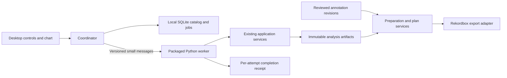

# SetVector desktop implementation order

**Build SetVector as an installed PySide6 application supervising a packaged Python worker, then make reviewed DJ preparation and Rekordbox export the first complete product workflow.** Reuse the existing analysis services, immutable artifacts and HTML chart; keep library state and job control in a separate desktop adapter. This recommendation is conditional on a small Windows and macOS packaging experiment, because the actual numerical dependencies, codecs and browser resources determine whether the approach ships reliably. Prove the real worker before investing in the shell, and implement reviewed annotation records alongside that experiment. Build durable import and recovery next, join them to listening and cue review, and prove Rekordbox interchange before investing in automatic sequencing. Start planning by reordering a reviewed crate, then add selection from the library and automatic musical evidence. This order gives each step a usable result while testing the assumptions that would make later work expensive to revise. The framework choice and order are engineering recommendations; no desktop build, interoperability experiment or performance benchmark was executed for this report. ([Application boundary](../docs/architecture.md), [Current implementation plan](../docs/implementation-plan.md), [Qt process API](https://doc.qt.io/qt-6/qprocess.html), [Tauri Python sidecars](https://v2.tauri.app/develop/sidecar/))

## The worker is the durable investment; the shell remains conditional

**Observed code:** SetVector already has `analyze_track(path, config, store)` and `render_report(feature_id, store, ...)`. Analysis validates and reuses its cache before decoding on a miss. Report generation loads saved artifacts independently, can use a relocated matching source, and can omit audio when the source is unavailable. The CLI returns small JSON results suitable for an initial process integration. These observations come from the inspected revision `cc1bab56caf7b9080f419d4a7aa2d779f93b4964`; they describe an integration boundary rather than a stable API guarantee. ([Analysis service](../src/setvector/application/analyze.py), [Report service](../src/setvector/application/report.py), [CLI](../src/setvector/cli/__init__.py))

**Recommendation:** use PySide6 Widgets for import, library, queue, review forms and errors, with one Qt WebEngine surface for the existing report. It fits a Python application whose complex custom visualization already exists in HTML. Run both analysis and report generation in a separately launchable worker; cached analysis does not make report rendering cheap, because preview creation reads audio and can transcode it, while the renderer embeds audio and arrays in HTML. A preview failure must leave the scientific result available. The first useful desktop demonstration is file selection → analysis → report → preview → reopen, requiring neither Rekordbox nor a hosted service to perform analysis. ([Preview implementation](../src/setvector/ingestion/preview.py), [HTML renderer](../src/setvector/visualization/html.py), [Qt for Python](https://doc.qt.io/qtforpython-6/))

**Source-backed constraints:** Qt WebEngine deploys browser helpers and resources, and it excludes the Mac App Store. Tauri supports the same Python worker through a sidecar with stdin/stdout, while using Windows WebView2 and macOS WKWebView. Every candidate still has to distribute SetVector's native Python stack. There is no measured evidence that any complete SetVector bundle is smallest or fastest. ([WebEngine deployment](https://doc.qt.io/qt-6/qtwebengine-deploying.html), [WebEngine platform restrictions](https://doc.qt.io/qt-6/qtwebengine-platform-notes.html), [Tauri sidecars](https://v2.tauri.app/develop/sidecar/), [Tauri webviews](https://v2.tauri.app/reference/webview-versions/), [Python dependencies](../pyproject.toml))

| Candidate | Why it fits | Condition that should select it |
|---|---|---|
| PySide6 Widgets + WebEngine + Python worker | Python host, native library controls, reuse of current chart | Default if the packaged workflow passes and direct distribution is acceptable |
| Tauri + the same Python worker | Strong fit for an application built mainly in HTML; existing sidecar and installer mechanisms | Prefer if most product screens will be custom web UI or a Qt constraint is disqualifying |
| Electron + the same Python worker | Bundled Chromium gives one browser family and familiar JS tooling | Consider when measured OS-webview incompatibility or team requirements justify its runtime and update burden |
| pywebview, or Toga + Briefcase | Credible Python alternatives with embedded webviews | Revisit for a specific Qt blocker after verifying worker, media and delivery integration |

This comparison is an architectural assessment, not a scored benchmark. Electron assigns its bundled runtime maintenance to the distributor; pywebview and Briefcase have their own packaging paths. A small empty window comparison would not answer whether the actual analyzer and media workflow ship. **Choose hard gates first:** complete offline installation, correct artifacts, controllable worker lifetime, usable playback, accessible core actions and a viable distribution route. Compare measured effort and footprint only among candidates that pass. ([Electron security](https://www.electronjs.org/docs/latest/tutorial/security), [pywebview freezing](https://pywebview.flowrl.com/guide/freezing.html), [Briefcase platforms](https://briefcase.beeware.org/en/stable/reference/platforms/index.html))

Start with a pinned PyInstaller directory bundle for the real worker on Windows x64 and macOS arm64. Then add the smallest Qt window and real report. PyInstaller bundles are specific to the build platform; a universal Mac application requires compatible architecture slices throughout its dependencies. Evaluate `pyside6-deploy`/Nuitka for a concrete packaging problem, rather than assuming compilation accelerates numerical code. Separate Intel Mac builds are conditional on supported dependencies, demand and actual testing. ([PyInstaller operation](https://pyinstaller.org/en/stable/operating-mode.html), [Mac architecture requirements](https://pyinstaller.org/en/stable/feature-notes.html), [pyside6-deploy](https://doc.qt.io/qtforpython-6/deployment/deployment-pyside6-deploy.html))

A proposed experiment budget is eight engineering days: worker packaging first; shell, chart and playback next; interruption and codec testing next; clean installers and a decision record last. This is a timebox, not a delivery estimate. Allow a short Tauri comparison only for a material Qt failure or a predominantly web interface, using the identical worker and report. A failure shared by every shell, such as a missing numerical dependency, should be resolved before comparing interface frameworks.

## Separate scientific evidence, user state and process control

The concrete proposed layout is `desktop/src/setvector_desktop/` containing UI, coordinator, catalog, protocol and worker adapters. The worker imports existing application services and artifact readers; the GUI consumes small protocol records and catalog views. Pin a built core wheel from a known revision during the packaging experiment. Numerical routines, decoding, feature schemas and cache identities remain owned by the analysis implementation. This creates a practical boundary around concurrent analysis work without assuming which files another developer is currently editing. Recheck file ownership before implementation, and coordinate future progress callbacks or new core APIs explicitly. ([Dependency direction](../docs/architecture.md), [Package configuration](../pyproject.toml))

**Observed code:** a source asset is identified by whole-file bytes; feature identity adds extractor, configuration and dependency identity. Paths are excluded, and retagging changes byte identity. Old domain readers reject unknown fields and unsupported schema versions. Therefore worker protocol, scientific schema, report-view schema and catalog migration version need independent compatibility rules. An application package version alone also cannot identify uncommitted changes to an analyzer build. ([Identity implementation](../src/setvector/storage/canonical.py), [Extractor identity](../src/setvector/analysis/identity.py), [Ingestion](../src/setvector/ingestion/audio.py), [Strict validation](../src/setvector/domain/_validation.py))

**Recommendation:** for the disposable packaging proof, invoke the current CLI with an executable path and argument array. Before exposing a persistent queue, add a narrow UTF-8 newline-delimited JSON wrapper. A handshake declares protocol version, exact build identity, readable artifact schemas and capabilities. Each request carries a logical job ID, unique attempt ID, operation, validated configuration and input identity when known. Start with `analyze`, `render_report` and `read_summary`; add inspection only if import requires verified identity beforehand. Return a small summary and artifact references, keep arrays in their existing files, and reserve stderr for bounded diagnostics. Validate partial lines, size limits, attempt IDs, terminal messages and process exit. A normal exit without a valid result is a protocol error. ([CLI boundary](../src/setvector/cli/__init__.py), [QProcess channels and lifecycle](https://doc.qt.io/qt-6/qprocess.html))

**Progress must match implemented capabilities.** Today's synchronous analysis call has no callback or cancellation token, so a wrapper can show running state, elapsed time, completed-track counts and final cache status. It cannot reliably announce internal decode/extract/publish percentages. Declare `stage_progress:false` and `cooperative_cancel:false` until the engine implements them. Avoid using silence on stdout as evidence of a hung numerical operation. Begin with one process per job and one active expensive operation; measure scientific-library startup before considering a persistent worker. ([Current analysis API](../src/setvector/application/analyze.py))

SQLite becomes justified when jobs, relinking and selected review revisions must survive restarts. Its purpose is transactional mutable state; 2,000 tracks alone does not establish a performance requirement. Keep `assets`, `locations`, `analysis_refs`, `jobs` and `job_attempts` as the initial entities. Store small, versioned display summaries so a library view does not decode every NPZ bundle. Add a logical track identity before annotations or playlists need to survive retagging or alternative encodings, with explicit user-confirmed relationships; do not silently transfer cues between changed audio. Keep arrays, immutable review snapshots and scientific manifests outside the catalog. A saved plan pins exact feature and annotation IDs, while the catalog can choose which review revision future plans use. ([Artifact store](../src/setvector/storage/artifacts.py), [Reviewed annotation plan](../docs/superpowers/plans/2026-09-23-reviewed-annotations.md))

Use one catalog owner on a coordinator thread with short transactions, enabled foreign keys, a migration version and database-aware backups. Store active data in local application storage outside the repository, OneDrive and source-music folders. WAL is optional until concurrent readers justify it; it still allows only one writer and requires same-host access. File size and modification time can trigger rescans, but content verification determines identity. Relinking updates locations rather than rewriting scientific provenance. ([SQLite foreign keys](https://sqlite.org/foreignkeys.html), [SQLite WAL](https://sqlite.org/wal.html), [SQLite backup API](https://docs.python.org/3.11/library/sqlite3.html#sqlite3.Connection.backup), [Report relinking](../src/setvector/application/report.py))

Persist `queued → starting → running → completed | failed | cancelled | interrupted`, with `cancel_requested` as an intermediate intent. A retry gets a new attempt ID. Cancel a queued job without launching it; kill only the dedicated active worker and asynchronously confirm exit. Windows console workers may ignore the mechanism used by `QProcess.terminate()`, so process termination must be tested on each target. If validated publication wins a cancellation race, retain the result and show completion with a late-cancellation indication. Route terminal transitions through one coordinator function to prevent stale events from replacing the final outcome. ([QProcess termination](https://doc.qt.io/qt-6/qprocess.html))

**Artifact publication and catalog completion are separate commit boundaries.** Existing storage validates a temporary directory before renaming it into place; forced termination can bypass cleanup, and the code has not established power-loss durability. After a successful service call, the worker should publish a small per-attempt completion receipt before sending stdout. The coordinator validates the result and commits its reference and job completion together. On restart, a receipt or known expected feature ID can recover completed work. If the worker died after artifact publication but before its receipt, retry only when the original source identity and exact engine/configuration are known; otherwise show interrupted and require a deliberate new request. A pathname could now contain different audio. Prevent two coordinators from owning the same catalog, prove prior workers have exited before reconciliation, and never kill a process from a stale PID alone. ([Publication implementation](../src/setvector/storage/artifacts.py), [Identity-aware analysis](../src/setvector/application/analyze.py), [Qt application locking](https://doc.qt.io/qt-6/qlockfile.html))

## Build complete slices in dependency order

The following sequence is a recommendation derived from the current code and DJ preparation goals. The listed exit criteria are proposed evidence, not completed tests. **Packaging and reviewed annotations can proceed together**, because each uses established source-time and artifact contracts without requiring the other. Automatic musical research can also continue alongside manual preparation, but enabling its outputs requires separate evaluation. ([Implementation plan](../docs/implementation-plan.md), [Annotation contracts](../docs/superpowers/plans/2026-09-23-reviewed-annotations.md))

| Slice | Complete result and prerequisite | Why it comes here | Exit evidence |
|---|---|---|---|
| 0. Bounded compatibility contract | Pin the core build; propose initial OS/CPU/format support, source-time rules, maximum recording length and resource budgets | Stops different parts from assuming different identities or release promises without blocking on every future planner decision | Installed CLI fixtures reopen correctly; open release assumptions are explicit |
| 1A. Packaged worker, then minimal window | Analyze one real file, render its report, preview/seek and reopen saved results on both OSs | Every shell depends on the numerical bundle; media and resources must work before library-screen investment | Clean-machine operation without Python or networking, cache reuse, missing-audio viewing, controlled worker crash/cancel |
| 1B. Reviewed records and evaluation collection | Template → edit → import → inspect an immutable annotation revision | Human evidence enables useful preparation before robust automatic cue/key/energy inference exists | Stable IDs, correct source bounds, preserved raw features, rejected wrong parents and evaluation-family leakage |
| 1C. Rekordbox interchange experiment | Establish a target-version import fixture and explicit field mapping alongside the worker proof, before substantial UI work | Export behavior can change annotation and preparation requirements; discover it before a cue editor or planner depends on unsupported fields | Imported and re-exported fixture proves the promised cues, ordering and available analysis fields; omissions and conversions recorded |
| 1D. Pure exporter and preflight | After reviewed source contracts and the interchange experiment, export a simple ordered list with explicitly selected cues through an application service/CLI | XML and timing rules can be proved before a desktop editor or search optimizer exists | Deterministic XML plus sidecar; validated files, IDs, limits and cue selections; real-application round trip passes |
| 2. Durable library and jobs | Progressive import, content/location distinction, summaries, one active worker, queue, retry, cancellation and relink | Long imports introduce recovery requirements before they justify parallel execution | 200- and 2,000-entry enumeration; per-file failure isolation; restart and publication-race recovery; measured memory and elapsed time |
| 3. Review while listening | Select a track, listen/seek, edit reviewed cues and judgments, save a new revision | Makes annotation correctness practical in daily preparation; source-time accuracy precedes export and transitions | Reopened revisions do not drift; keyboard time entry works; estimates and reviews stay distinct; source/preview alignment verified |
| 4. Manual crate and usable export | Save and reorder a crate, choose entry/exit cues, inspect directional transitions, connect the editor to the qualified export service | Produces the user's preparation output before automatic search introduces more uncertainty | Importable crate with verified order and cues; explicit conflict/loss report; repeat occurrences and timed assumptions preserved in SetVector |
| 5. Suggested reorder | Reorder a supplied reviewed crate with anchors, required tracks and explained alternatives | Fixing track selection makes transition quality and duration logic independently assessable | Hard constraints pass; small exact cases and greedy baseline comparisons; 1–3 hour bounds or explained failure; blind DJ comparison |
| 6. Choose from library | Add selection, exclusion, inclusion preference and search limits using the same request/result contract | Adds the selection problem after ordering and timing are established | Mandatory tracks survive pruning; no trivial optimum; elapsed-time arc stays correct after replacements; bounded-search status remains truthful |
| 7. Validated automation and listening mode | Introduce automatic evidence as it passes held-out evaluation; share planner machinery with a distinct listening objective | Automation can improve reviewed preparation incrementally; listening has different duration and transition assumptions | Per-style and cross-style error/abstention evidence; comparison with simple baselines; preserved manual correction path |

The 1A–1C rows are concurrent branches, not a requirement to finish the desktop before trying XML. The pure exporter follows source-contract and compatibility evidence and can finish before the durable desktop library. The first installable inspection slice is a technical milestone. **The first complete DJ product slice includes reviewed cues, a saved crate and verified Rekordbox import.** This prevents a long chart-polishing phase from becoming a substitute for the requested preparation outcome. A readable preparation sheet remains useful alongside the export for information Rekordbox cannot represent. Advanced planning, automatic updates, filesystem watchers, worker pools and sophisticated waveform editing can follow evidence that the basic workflow works.

For early report reuse, load the generated file by URL: Qt documents an approximately 2 MB limit for `setHtml()`. Generate reports on demand and cache by feature ID, renderer/build version and audio mode. Later, separate reusable in-app chart assets from portable HTML export and cache previews independently. Retain the current browser player if it passes the required tests; introduce `QMediaPlayer` only when codec, timing or workflow evidence warrants it. Whichever transport is chosen, use one authoritative player clock, source seconds at the boundary, and a precise numeric cue editor as an accessible alternative to dragging. ([QWebEngineView](https://doc.qt.io/qt-6/qwebengineview.html), [Report player](../src/setvector/visualization/assets/report.js), [QMediaPlayer](https://doc.qt.io/qt-6/qmediaplayer.html), [Qt Multimedia](https://doc.qt.io/qt-6/qtmultimedia-index.html))

The scientific limitations affect this order directly. Current outputs include RMS, spectral centroid, bass power ratio, onset strength and estimated tempo/beats. RMS is not standardized loudness; onset strength is normalized within each track; downbeats are empty; calibrated cross-track energy, reliable phrase boundaries and key inference are unfinished. Begin with reviewed cues, explicit missing evidence and user energy judgments. An automatic detector should produce a separately versioned result with uncertainty, and must not silently replace the evidence pinned by an existing plan. ([Implemented measurements and limitations](../docs/implementation-plan.md), [Report model](../src/setvector/visualization/model.py), [Bundle schema](../src/setvector/domain/bundle.py))

Planning must represent ordered occurrences separately from timed placements. A track can occur twice, A → B differs from B → A, and B's entry from A must precede a feasible exit into C. Source trims, playback-rate mappings and overlap determine duration. Start with deterministic greedy ordering, then compare bounded beam or local improvement against it and exact tiny cases. A result from bounded search is “best found within budget”; failure to find a plan is not proof of infeasibility. Reviewed planning can proceed while rhythm, key, phrase and energy research improves on a separate evaluation track. ([Transition and planner contracts](../docs/implementation-plan.md), [Timed-set architecture](../docs/architecture.md))

## Rekordbox interoperability needs its own evidence boundary

**Source-backed finding: Rekordbox XML is the appropriate first interchange route.** The official developer page publishes a playlist XML format, and the current version 7 manual documents importing XML tracks into Collection and XML playlists into Playlists. It also documents XML export, optional beatgrid export, automatic analysis and Analysis Lock. This establishes an available workflow; it does not establish that every third-party field survives import or overwrites an existing track correctly. The older developer page's “Bridge” wording should not be copied into current instructions. ([Official developer page](https://rekordbox.com/en/support/developer/), [Rekordbox 7 manual, XML import/export and analysis settings](https://cdn.rekordbox.com/files/20260409151936/rekordbox7.214_manual_EN.pdf))

**Recommendation:** export XML referencing unchanged local songs, a playlist in the intended order, and a conservative set of validated cues and analysis fields. **XML does not embed the playable songs.** Start with files in place; if transfer between machines is selected for release, add a separate audio-copy operation with paths regenerated for the destination and copied bytes verified. Copying or referencing a song retains its source timeline; trimming, rendering and re-encoding create additional timing and identity problems and should have their own future design. SetVector continues to analyze and prepare offline independently of Rekordbox. M3U8 can serve as an order-only fallback; the rich metadata mapping uses XML. ([Rekordbox 6.7 manual, playlist import formats](https://cdn.rekordbox.com/files/20230316171900/rekordbox6.7.0_manual_EN.pdf), [Rekordbox XML specification](https://cdn.rekordbox.com/files/20200410160904/xml_format_list.pdf))

| SetVector data | Published XML representation | What must be demonstrated |
|---|---|---|
| Local song | `TrackID`, `Location` file URI | Intended file resolves; export ID is not mistaken for Rekordbox's internal identity |
| Playlist order | Playlist node references to collection tracks | Order and repeated references survive the target import workflow |
| BPM and musical key | `AverageBpm`, `Tonality` | Values and key spelling survive; estimates remain visibly distinguished in SetVector |
| Validated grid | `TEMPO` anchors with `Inizio`, `Bpm`, `Metro`, `Battito` | Beat phase and meter are correct across the track; a global BPM alone cannot establish a grid |
| Reviewed cue or loop | `POSITION_MARK` name, type, start/end and number | Time, label, slot and loop behavior survive within supported limits |
| Energy/transition explanation | Optional concise `Comments` plus a SetVector sidecar | Existing comments are preserved according to an explicit conflict policy |
| Feature arrays, confidence and full plan | SetVector sidecar/report | No claim that XML turns these into native Rekordbox waveform, phrase or stem analysis |

The mapping table distinguishes **schema capability from verified import behavior**. The published XML table gives seconds for tempo anchors and cue locations, specifies memory-cue numbering and hot slots A–C, but does not document the full contemporary A–H range, cue colors or arbitrary feature arrays. The current manual's larger UI capability does not fill those interchange gaps. Build fixtures by exporting from the exact supported Rekordbox version, and enable only fields whose round trips pass. Keep SetVector's richer records authoritative and record omissions in an export receipt. ([Published XML field table](https://cdn.rekordbox.com/files/20200410160904/xml_format_list.pdf), [Current hot-cue controls](https://cdn.rekordbox.com/files/20260409151936/rekordbox7.214_manual_EN.pdf))

The export adapter needs a small set of explicit projection contracts. These are recommendations extending the existing source-time and immutable-review design; they are not implemented APIs. ([Reviewed annotation plan](../docs/superpowers/plans/2026-09-23-reviewed-annotations.md), [Source-time and occurrence contracts](../docs/architecture.md))

| Proposed contract | Purpose |
|---|---|
| `ExportSnapshot` | Pin exporter/profile version, plan, asset/feature/review IDs, selected metadata, audio locations, timing transform, output hashes and omission reasons |
| `ExportCueSelection` | Select an exact source trigger, point/loop type, explicit loop end, destination slot and label from a reviewed annotation |
| `ReviewedGrid` | Describe validated source-relative tempo segments, phase, meter, beat-in-bar, coverage and provenance |
| `ExportLocation` | Bind an asset hash to its chosen output path/URI and optional verified byte-identical copy |
| `TrackOccurrence` | Preserve repeated use and contextual cue choices independently of the collection track record |

**A reviewed cue region is not yet an exportable hot-cue trigger.** A usable entry interval such as `[16,32)` does not say whether the jump target is 16 seconds, a reviewed beat inside it or another selected point; it also does not imply a loop. Add cue selection as a projection input without changing the annotation region's meaning. Similarly, current beat estimates and isolated downbeat anchors do not specify a complete grid with meter. The first exporter can deliver playlist order and reviewed point cues while omitting grids. Require a selected confirmed human revision first, use qualified automatic data only under an enabled policy, and omit unknown information. A reviewed unknown key must suppress an old automatic guess. Experimental energy must not silently become the user's star rating. ([Annotation semantics](../docs/superpowers/plans/2026-09-23-reviewed-annotations.md), [XML cue/grid/rating fields](https://cdn.rekordbox.com/files/20200410160904/xml_format_list.pdf))

Export source seconds directly. If a timed placement maps source position `s` to set position `T + (s - source_in) / r`, the cue export still uses `s`. Do not export set elapsed time, scale seconds by an analysis sample-rate ratio, or reconstruct saved timestamps from frame indices. Keep any measured decoder offset distinct from tempo adjustment. Serialize finite nonnegative fractional values independently of locale and check duration and target-profile bounds; an exact EOF annotation can be valid internally while being unusable as a jump target. Surface that projection failure instead of shifting it silently. ([Source-time contract](../docs/architecture.md), [Feature timestamps](../src/setvector/domain/features.py), [XML seconds fields](https://cdn.rekordbox.com/files/20200410160904/xml_format_list.pdf))

Implement a pure serializer behind an application service and CLI before wiring up graphical export. Preflight verifies source-file existence and hashes, supported values, cue limits, duplicate slots, counts and references. Use a URI encoder followed by a standard XML writer; percent encoding a file path and escaping an XML attribute are separate operations. Keep integer XML track IDs separate from content hashes through a collision-checked mapping. Preserve actual path spelling, disambiguate sibling playlist names and portable-copy filename collisions, and publish validated XML, sidecar and receipt together from a temporary directory. A report can remain useful without source audio; an export cannot promise playable songs when those files are missing. ([XML paths and IDs](https://cdn.rekordbox.com/files/20200410160904/xml_format_list.pdf), [Sibling-name restriction](https://rekordbox.com/en/support/developer/), [Content verification](../src/setvector/ingestion/audio.py))

**The critical early experiment is an installed semantic round trip.** Start with a disposable library and controlled local files containing distinctive BPM/key, named memory/hot cues, a loop and a nonalphabetical playlist order. Export a reference from Rekordbox, produce an equivalent SetVector XML, import its tracks and playlist, then export again. Compare semantic values with declared rounding tolerances and listen to cue jumps; matching XML alone cannot establish audible alignment. Repeat with existing tracks carrying deliberately conflicting cues, comments and grids, testing explicit track import separately from playlist import and repeating the import to expose duplicates. Test automatic analysis both enabled and disabled, then determine the safe order for native waveform analysis, external cues/grids and Analysis Lock. The manual documents these mechanisms but does not guarantee their combined precedence. ([Rekordbox 7 manual](https://cdn.rekordbox.com/files/20260409151936/rekordbox7.214_manual_EN.pdf))

Include WAV/FLAC and MP3 CBR/VBR, Unicode and reserved URI characters, removable/moved files and a Windows-to-macOS relocation. Preserve decoded-source timing in SetVector and add an offset only when a measured decoder/player relationship justifies it. Do not guess encoder delay from the extension. Record the exact Rekordbox version, platform, import method and field capabilities in the export profile; document the verified user steps with the output. If USB/player delivery is intended, test that route after desktop import because hardware capacities differ. These are acceptance requirements, not results established by this research. ([XML location and time fields](https://cdn.rekordbox.com/files/20200410160904/xml_format_list.pdf), [Official relocation guidance](https://pioneer-support.zendesk.com/hc/en-us/articles/8113238460441-How-can-I-use-Auto-Relocate-and-Relocate-to-find-missing-files), [Rekordbox 7 manual](https://cdn.rekordbox.com/files/20260409151936/rekordbox7.214_manual_EN.pdf))

Use an inspectable export file as the first adapter. Do not make a live database writer or native analysis-file generator a prerequisite. If one song occurs in several sets with different neighboring tracks, preserve those occurrence-specific transition decisions in SetVector and resolve which cues are projected into its single exported track record explicitly. Conflicting hot slots require a reviewed combined selection or separate alternative export snapshots; inventing new track IDs for the same path does not establish per-playlist cue isolation.

**Existing-library reimport is a separate qualification step before synchronization.** After clean imports work, test identical XML twice, changed cues with the same ID, a new ID at the same path, changed paths, existing manual cues, renamed playlists and repeated occurrences. Optional diff/merge can later use a user-exported Rekordbox XML baseline with explicit ownership and ambiguous-match refusal. A deterministic SetVector export does not make Rekordbox import idempotent. Rekordbox also documents CUE Analysis overwrite behavior, so the supported workflow must qualify both ordinary reanalysis and cue analysis, rather than assuming Analysis Lock preserves every imported field in every scenario. Do not advertise bidirectional synchronization until these conflicts and repeated imports are demonstrated. ([Rekordbox CUE Analysis FAQ](https://rekordbox.com/en/support/faq/rekordbox7/#faq-70993), [Collection XML export](https://rekordbox.com/en/support/faq/rekordbox7/#faq-84655), [Rekordbox 7 manual](https://cdn.rekordbox.com/files/20260409151936/rekordbox7.214_manual_EN.pdf))

## Resource and release gates determine what can be promised

**Observed code:** decoding holds the complete float32 audio and creates a contiguous copy; report previews add full-file reads and potential transcodes. One hour of stereo 44.1 kHz float32 PCM is `3600 × 44100 × 2 × 4`, about **1.18 GiB for one buffer**, before copies, resampling and runtime memory. This arithmetic is not a measured peak. A 1–3 hour planned set does not imply support for an individual recording of that duration. Keep one active expensive job, prevent simultaneous full preview transcodes, and select a maximum recording duration against a named reference machine before promising long-file support. ([Decoder](../src/setvector/ingestion/audio.py), [Preview](../src/setvector/ingestion/preview.py))

| Gate | Required observation before the relevant release claim |
|---|---|
| Offline delivery | Complete installer; first launch, analysis, cached reopen, chart, preview and export pass with networking blocked and no developer Python |
| Numerical parity | Packaged and unfrozen runs use the same dependency environment, identities and schemas; arrays match declared domain tolerances |
| Responsiveness and cancellation | Measure the whole process tree and UI during analysis; suggested initial UI p95 acknowledgement under 100 ms and no main-thread stall over 500 ms; hard cancellation leaves no live orphan or false success |
| Startup and resource budget | Record cold/warm startup, first-analysis/JIT cost, per-track peak RSS, batch completion, cache size and installer footprint; proposed warm ≤3 s and cold ≤8 s need validation on named hardware |
| Media and cue accuracy | Separate analyze/playback fixtures for each promised WAV, AIFF, FLAC and MP3 variant; test VBR seeks, boundaries, source/preview offsets, device changes and analysis load |
| Durable state | Inject crash before/after publication and receipt, exit without a result, disk-full save, replaced/moved/missing source, malformed protocol, repeated cancellation and failed migration |
| Accessible workflow | Import, start, cancel, select, play, seek and edit cues by keyboard; useful labels/focus in a Windows screen reader and VoiceOver; textual alternatives to canvas values |
| Rekordbox delivery | Verify the supported field mapping, playlist order, paths, duplicates, cue timing and import conflicts in the named Rekordbox version and re-export the fixture for comparison |
| Upgrade and distribution | Replacement install preserves artifacts and user state; failed migration can restore its backup; validate final signed Windows package and notarized/stapled Mac delivery |

The numerical budgets above are proposed starting targets, not accepted requirements or measured results. Playback seek position within 100 ms can be a usability probe, but cue interchange needs a separately declared timing tolerance based on actual import/export precision and musical requirements. Memory and full-batch limits remain unset until reference hardware and maximum source length are selected. Attribute failures to the worker, report generation, browser, player or duplicated runtime before changing the shell. Neither preview playback nor the framework choice establishes sample-accurate DJ mixing, time stretching, controller support or multichannel cueing. ([Qt Multimedia platform behavior](https://doc.qt.io/qt-6/qtmultimedia-index.html), [QMediaPlayer timing API](https://doc.qt.io/qt-6/qmediaplayer.html))

Use complete installers and direct signed distribution initially, with user data outside program files and manual replacement upgrades. Qt WebEngine's store restriction makes the distribution assumption consequential. macOS delivery requires a signing/notarization pipeline; on Windows, signing establishes publisher identity but does not guarantee the absence of SmartScreen warnings. An optional future update check must never gate analysis. Inventory the exact Qt, Chromium, numerical and codec dependencies and verify their redistribution obligations; dynamic linking alone does not complete Qt LGPL obligations. ([Qt platform restrictions](https://doc.qt.io/qt-6/qtwebengine-platform-notes.html), [macOS signing workflow](https://v2.tauri.app/distribute/sign/macos/), [Microsoft SmartScreen](https://learn.microsoft.com/en-us/windows/apps/package-and-deploy/smartscreen-reputation), [Qt LGPL guidance](https://www.qt.io/development/open-source-lgpl-obligations), [WebEngine licenses](https://doc.qt.io/qt-6/qtwebengine-licensing.html))

Imported filenames, tags and reports enter a privileged desktop application. Escape displayed metadata, restrict navigation/resources, and expose named bridge operations rather than arbitrary shell or filesystem access. A child process provides failure isolation and lifecycle control; it is not an OS sandbox for audio parsing. An HTTP server adds origin, authentication and lifetime work without being necessary for this proposed process boundary. ([Electron security principles](https://www.electronjs.org/docs/latest/tutorial/security), [pywebview local-server security](https://pywebview.flowrl.com/guide/security.html), [QProcess](https://doc.qt.io/qt-6/qprocess.html))

**Untested assumptions remain explicit:** the Qt shell fits the intended visual product and developer skills; direct download is acceptable; Windows x64 and macOS arm64 cover the first users; required codecs package successfully; playback aligns accurately with decoded-source timing; the process lifecycle survives abnormal parent death; the export subset meets the user's Rekordbox workflow; and startup/memory fit an as-yet unselected minimum machine. Minimum OS versions, Intel Mac/Windows ARM scope, maximum recording duration, signing access and exact interchange semantics must be resolved before dependent release promises. This research did not run installed builds, sign binaries, validate library replacement, benchmark 2,000 tracks, perform actual power-loss testing or import into Rekordbox.

## Conclusion

The most valuable early artifact is a small, repeatable acceptance collection spanning installed analysis, reviewed source-time cues and Rekordbox interchange. It can decide a shell change, expose a decoder or timing problem and constrain an export mapping without discarding the scientific engine. After those boundaries work, a saved manual preparation workflow gives DJs a concrete result and supplies the evidence needed to judge whether automatic ordering and energy models actually improve it.
