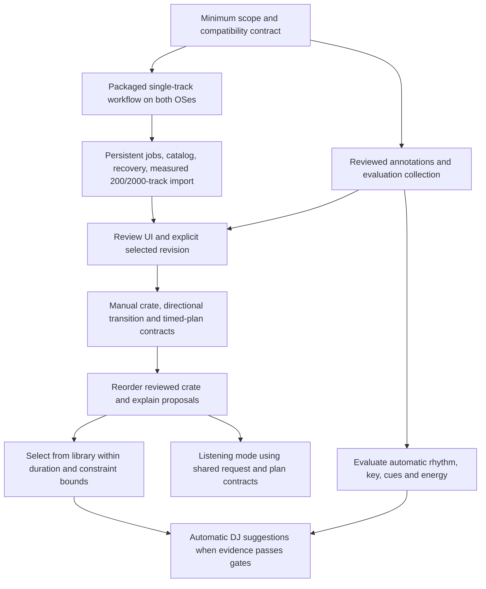

# SetVector implementation sequence

## What is already usable, and what actually depends on what?

### Takeaway

The shortest credible route is two concurrent workstreams after a small release and compatibility contract: prove that a packaged single-track application works on both systems, while adding reviewed annotations and an evaluation collection to the Python core. Join those streams at a durable library and review interface, then implement reviewed-cue planning before automatic musical inference. This is a proposed dependency order, not a measured schedule.

### Cited Findings

- Repository inspection used clean Git revision `cc1bab56caf7b9080f419d4a7aa2d779f93b4964`; `git status --short` was empty. Implemented application services are synchronous single-track analysis and report rendering. Analysis computes identity before decode, validates and reuses the cache, then persists features. Report rendering loads stored artifacts independently and can omit audio or use a matching relocated source. [Analysis service](../../src/setvector/application/analyze.py), [Report service](../../src/setvector/application/report.py).
- The installed package already contains an offline report with an audio player and baseline measurements. Its current measurements do not establish calibrated energy, reliable phrase boundaries, key, or downbeats; report downbeats are explicitly empty. [Implementation plan](../../docs/implementation-plan.md), [Report model](../../src/setvector/visualization/model.py).
- The reviewed-annotations feature is specified but absent from the inspected source tree. The plan supplies immutable full snapshots, explicit parent/revision IDs, source-time bounds, separate estimates and corrections, and collection splits that keep related edits together. Graphical editing and pair/sequence judgments are deliberately deferred. [Focused annotations plan](../../docs/superpowers/plans/2026-09-23-reviewed-annotations.md).
- Existing artifact publication validates a temporary directory before publishing it with a directory rename; reading validates identity and contents. A catalog update is not part of this operation. [Artifact store](../../src/setvector/storage/artifacts.py).
- The current roadmap already places reviewed cues before automatic beat/key/structure work, supplied-crate reordering before choose-from-library search, and user energy judgments before automatic cross-track calibration. It requires source timing, playback rates, overlap, and adjacent cue compatibility when computing planned duration. [Implementation plan](../../docs/implementation-plan.md).
- Qt offers asynchronous process signals, separate stdout/stderr channels, explicit argument lists, and kill/error handling; blocking waits on the GUI thread can freeze it. Windows console workers may not respond to `terminate()` and require `kill()`. [Qt QProcess](https://doc.qt.io/qt-6/qprocess.html).

### Inferences

**Recommended dependency graph:**

- Packaging and annotations are independent because the first desktop can consume existing reports without knowing about corrections, while the annotation service can use saved artifacts without a desktop. Keep changes in separate adapters/domain modules, sharing the agreed artifact and source-time definitions. This makes useful parallel work possible without introducing two analysis implementations. [Architecture](../../docs/architecture.md), [Focused annotations plan](../../docs/superpowers/plans/2026-09-23-reviewed-annotations.md).
- Keep the next core feature as reviewed annotations. A desktop research branch need not reorder the existing scientific roadmap. Starting a small packaging proof concurrently is justified because deployment failure could change the shell choice, while annotation validity remains useful under any shell. [Prior desktop report](../../reports/SetVector%20standalone%20analysis%20integration.md).
- Adopt SQLite when committing to durable desktop jobs and selected review revisions, even if 2,000 rows alone would not justify it. The reason is coordinated updates and recovery of mutable user state. The existing architecture's conditional database recommendation is appropriate for the CLI; the expanded desktop workflow introduces a new concrete requirement. Keep immutable arrays and revisions outside the database and reference their IDs. [Architecture](../../docs/architecture.md), [SQLite WAL](https://sqlite.org/wal.html).
- Do not persist the chosen review only as a mutable field inside raw features. The catalog can choose a revision for a library entry, but each saved plan must pin its exact feature and review IDs. A later correction should mark dependent plans as based on older evidence and offer recomputation; it must not silently rewrite an old proposal. [Architecture](../../docs/architecture.md), [Focused annotations plan](../../docs/superpowers/plans/2026-09-23-reviewed-annotations.md).

### Gaps

- No packaged desktop build, resource measurement, or listening experiment was executed in this audit. The optimal order follows dependency and failure-cost reasoning; it has not been compared experimentally with another development schedule.
- Minimum OS versions, Intel Mac support, initial audio formats, maximum source-track duration, reference machines, latency/memory targets, distribution channel, and signing availability are unresolved. Windows/macOS and a 1–3 hour planned set are goals; neither specifies the maximum length of an individual imported recording.

## Which vertical slices should be delivered, and why in this order?

### Takeaway

Each slice should give the user a complete action with persisted, inspectable results. The gates below are proposed acceptance criteria; none is a claim that the code currently passes them.

### Cited Findings

- PyInstaller bundles Python and dependencies and produces an artifact for the active build platform; a one-folder build is easier to inspect while diagnosing dependency collection. [PyInstaller operating model](https://pyinstaller.org/en/stable/operating-mode.html).
- Qt's `setHtml()` has a 2 MB content limit. Loading a local report file avoids that specific data-URL path. [QWebEngineView](https://doc.qt.io/qt-6/qwebengineview.html).
- Qt Multimedia documents platform/backend differences and recommends testing on target platforms. `QMediaPlayer` supplies seeking, position, duration, playback state, and errors. [Qt Multimedia](https://doc.qt.io/qt-6/qtmultimedia-index.html), [QMediaPlayer](https://doc.qt.io/qt-6/qmediaplayer.html).
- The current decoder reads the complete audio into memory; desktop concurrency therefore needs measurement before increasing active workers. [Audio ingestion](../../src/setvector/ingestion/audio.py).
- The planner must distinguish ordering, timed proposals, and mixed audio, and preserve directional edges, hard constraints, uncertainty, and search-budget status. [Implementation plan](../../docs/implementation-plan.md).

### Inferences

| Slice | Complete user outcome and implementation | Why it belongs here | Proposed exit evidence |
|---|---|---|---|
| 0. Compatibility and scope | Record the baseline artifact versions, worker executable contract, supported initial OS/CPU/format matrix, maximum source duration, and proposed performance budgets. Source time remains seconds from decoded audio. | Prevents a UI or installer from assuming a different definition of identity, timing, or support. Keep this bounded; do not wait for every future planner choice. | The existing installed CLI can analyze and reopen the selected fixtures; chosen support assumptions and unresolved release gates are written down. |
| 1A. Installed single track | A small PySide6 window opens a file, starts one packaged worker, displays status/error, loads the offline report by local URL, previews and seeks, and reopens saved results. Use existing CLI JSON through argument arrays initially. | Tests the risky Python/NumPy/audio/Qt distribution combination before a broad UI is built. Preserves useful code if the shell must change. | Run the same workflow on clean Windows and macOS without developer Python and with networking blocked; demonstrate cache reuse, missing-source no-audio viewing, and worker cancellation/crash without closing the app. Record startup, job latency, peak memory, and seek behavior. |
| 1B. Reviewed records | Template → edit → import → inspect an immutable annotation revision, plus a pinned development/held-out collection. | Gives future planning reliable human evidence while estimators are still incomplete. Can run alongside 1A. | Full round-trip with exact IDs; raw artifact bytes unchanged; out-of-range cues and mismatched asset/feature parents rejected; source audio can be absent; family leakage rejected. |
| 2. Durable library | Progressive import into a local catalog, one active worker, persisted queue, deduplication by file identity, cache reuse, retry, cancellation, restart reconciliation, explicit rescan/relink. | A batch introduces failure and mutable state before it introduces a need for extra processes. Recovery semantics must precede a user's large import. | Controlled 200- and 2,000-entry libraries remain enumerable after restart; successful artifacts survive per-file failures; duplicate bytes reuse analysis; moved/missing files retain saved results; all jobs reach a truthful reconciled state. Capture real elapsed times and memory. |
| 3. Review while listening | Select track, preview/seek, enter or adjust cues, tempo/key judgments and user energy rank, save a new revision, choose the revision used for future plans. Retain numeric keyboard editing as a precise accessible path. | Brings annotation contracts into the daily workflow before automatic suggestions create more correction burden. | Save/reopen revisions without drift; show estimated versus reviewed evidence; cue at source time resolves consistently after seeking; corrections never rewrite raw features; conflicting revisions require an explicit choice. |
| 4. Manual preparation and pair explanations | Create/save/reorder a crate manually; choose reviewed entry/exit points; inspect directional cut/short-blend assumptions and source/timed placements. Offer a readable saved preparation sheet before DJ-software export. | Reveals whether the plan and timing contracts match actual preparation needs before optimizing them. Gives value even when automatic search is poor. | A → B and B → A can differ; repeated tracks have separate occurrence IDs; source trims, rates and overlap produce correct duration; incompatible B entry/exit combinations are rejected or flagged; unknown key/phrase evidence is visible. |
| 5. Suggested reorder | Reorder a supplied reviewed crate, retain anchors/mandatory tracks, show multiple explained alternatives and allow manual adjustment. Start with deterministic greedy baseline; add bounded beam/local improvement against it. | Holds track selection fixed while evaluating whether the transition objective and timing logic work. Avoids conflating bad track selection with bad ordering. | Synthetic small cases compare with exact enumeration; every output satisfies hard constraints; 1-, 2-, and 3-hour proposals meet declared bounds or explain no result; DJs compare blind against simple baselines; saved plans pin assumptions and evidence IDs. |
| 6. Choose from library | Select and order from the 200–2,000-track catalog using inclusion preferences, required/excluded tracks, duration/count bounds and search limits. | Uses the tested transition/timing objective while adding the separate selection problem. | Both selection policies use the same request/result contract; no empty/trivial optimum; pruning preserves mandatory tracks; elapsed-time arc behavior remains correct after replacements; report best found within budget separately from proven infeasibility. |
| 7. Automatic evidence and listening | Add independently versioned automatic rhythm/key/cue/energy artifacts as their evaluations support them. Add listening mode with ordinary playback duration and a distinct objective using the shared selection/reorder engine. | Automation can replace manual evidence incrementally. Listening should reuse mature constraints while retaining its different timing/continuity assumptions. | Held-out per-style and cross-style results document strengths, abstentions and failures. DJ and listening modes have distinct evaluations. Automatic energy is enabled only after comparison with simple baselines; manual ranks remain available. |

These rows are engineering recommendations derived from the repository boundaries and existing plan, with installed-test additions from the desktop report. The table does not assert that any framework guarantees these application outcomes. [Architecture](../../docs/architecture.md), [Implementation plan](../../docs/implementation-plan.md), [Prior desktop report](../../reports/SetVector%20standalone%20analysis%20integration.md).

- During slice 1A, report generation must also run off the UI thread: it can load arrays, hash/reload audio, and generate large HTML. Putting extraction in a worker but rendering its report synchronously in the main window would leave a second expensive stage. [Report service](../../src/setvector/application/report.py).
- In slice 2, use a minimal versioned job envelope before persistent jobs reach users: job ID, requested operation/input/config identity, engine/protocol version, terminal result with artifact IDs, bounded stderr logs. Fine-grained percentages and a persistent bidirectional worker can wait for evidence. The current CLI's one JSON result suffices for the disposable slice-1 proof. [CLI](../../src/setvector/cli/__init__.py), [Qt QProcess](https://doc.qt.io/qt-6/qprocess.html).
- Defer broad chart redevelopment; improve only what slice 3 needs. The first report can keep its browser player. When native playback is introduced, define one authoritative player clock and keep source seconds at the bridge, then move in-app charts to reusable data/assets. Otherwise two competing clocks can make cue edits misleading. This is a design inference from the current report timing and Qt playback interface. [Report JavaScript](../../src/setvector/visualization/assets/report.js), [QMediaPlayer](https://doc.qt.io/qt-6/qmediaplayer.html).
- Treat automatic MIR/energy research as concurrent with reviewed planning, not as a prerequisite for it. However, no unvalidated estimator should silently replace reviewed cues in a saved proposal. Six styles and cross-style transitions require actual evidence, not hard genre rules. [Implementation plan](../../docs/implementation-plan.md).

### Gaps

- No quantitative latency, cancellation or memory threshold can yet be called accepted. Choose thresholds against a named minimum reference machine; record distributions for import-to-first-row, warm report open, UI response during analysis, per-track analysis, full-library completion, and worker peak RSS before promising support.
- A convenient initial proposal is WAV/AIFF/FLAC/MP3, but decode support and playback support must each pass their installed fixture matrix. No claim is made that every format currently works in the candidate bundle.
- A precise date or number of engineering weeks would require team capacity, packaging access and pilot measurements unavailable here. Dependency gates are more defensible than calendar estimates.

## Which failures must be addressed early, and what can safely wait?

### Takeaway

Protect user state and evidence identity before adding breadth or concurrency. Delay features that improve convenience until the intended offline import → inspect → correct → prepare workflow is reliable.

### Cited Findings

- WAL allows concurrent readers and one writer, requires same-host access, and has checkpoint behavior to manage. A database file alone is not the complete live WAL database state. [SQLite WAL](https://sqlite.org/wal.html).
- The annotation plan rejects malformed values, unknown fields, conflicting revisions, wrong feature/asset parents, and leaked evaluation families, and uses saved decoded duration rather than trusting approximate source metadata. [Focused annotations plan](../../docs/superpowers/plans/2026-09-23-reviewed-annotations.md).
- The baseline bundle's strict schema is intentionally narrow; new chroma and other multidimensional outputs require separately versioned contracts rather than silently adding arrays to old artifacts. [Baseline bundle](../../src/setvector/domain/bundle.py), [Implementation plan](../../docs/implementation-plan.md).

### Inferences

| Failure injection or scenario | Required behavior before dependent slice | Why this ordering prevents rework |
|---|---|---|
| Worker dies before/during artifact publication | No incomplete artifact is reported as a successful analysis; retain successful prior artifacts; classify interrupted job after restart. | Fixes durable state semantics before users run long batches. |
| Artifact published, app dies before catalog completion | Reconcile the validated artifact and job request; complete or make safely retryable without duplicate numerical work. | Exposes the two independent commit boundaries before adding workers or updates. |
| Cancellation races with successful publication | Distinguish a cancelled request from a valid published result; show a consistent final state and preserve usable cache. | Avoids treating job state as scientific truth. |
| Missing file, moved file, duplicate bytes, retagged file | Missing remains inspectable; relocated content is validated; duplicate locations share content identity; changed bytes are not silently attached to old reviews. | Keeps file locations separate from musical identity from the beginning. |
| Unicode/spaced/long paths; read-only music directory; removable drive disappears | Argument arrays and file APIs preserve paths; errors are actionable; source files remain untouched; other jobs continue. | Tests normal library behavior before cosmetic import improvements. |
| Disk full or malformed catalog/annotation during save | Do not claim save succeeded; preserve prior committed state; offer repair/retry without deleting scientific artifacts. | User corrections are harder to recreate than analyzer caches. |
| Feature identity changes after engine/config upgrade | Existing plans retain old referenced evidence; new analysis coexists; deliberate recomputation creates new results. | Prevents incompatible scores or corrections being silently applied. |
| Cue at zero, exact EOF, negative/NaN time, region reversal, different sample rates | Valid source points/intervals follow one declared convention; invalid bounds fail consistently in CLI and UI. | Timing errors propagate into every duration and transition later. |
| App upgraded with pending jobs and old catalog | Transactional migration, verified backup/restore, compatibility check and truthful interrupted state. | Upgrade policy is inexpensive while schemas are small. |
| B's entry from A lies after the exit selected for C | Reject the whole-plan inconsistency or choose another cue combination. | A pairwise optimizer built before this contract would require state redesign. |
| Weak tempo/key/phrase information | Unknown or review-needed result, with an allowed cut/manual alternative; do not fabricate numeric certainty. | Keeps user trust and permits new estimators without changing missingness semantics. |

These are proposed failure tests grounded in current publication, timing and plan boundaries; none has been run for a desktop application. [Artifact store](../../src/setvector/storage/artifacts.py), [Architecture](../../docs/architecture.md), [Focused annotations plan](../../docs/superpowers/plans/2026-09-23-reviewed-annotations.md), [Implementation plan](../../docs/implementation-plan.md).

**Hard prerequisites by milestone:**

- Installed proof: one valid engine/artifact boundary, included dependencies/resources, offline fixture workflow on each promised platform, responsive process control, safe report loading. [Prior desktop report](../../reports/SetVector%20standalone%20analysis%20integration.md).
- Durable library release: persisted job outcomes, reconciliation, chosen app-data location, migrations/backups, content/location distinction, per-file failures and measured resource limits. Keep one catalog writer; evaluate whether WAL is useful rather than enabling it as a cure for concurrency. [SQLite WAL](https://sqlite.org/wal.html), [Architecture](../../docs/architecture.md).
- Reviewed planning: correct source-time bounds, immutable selected revisions, region summaries with validity/coverage, ordered occurrence and timed-placement contracts, explicit direction and assumptions, held-out review collection. [Implementation plan](../../docs/implementation-plan.md).
- Automatic suggestion claims: acceptance criteria and held-out comparison for each enabled evidence type, with missing/uncertain states retained. [Implementation plan](../../docs/implementation-plan.md).

**Can wait:** automatic updates, filesystem watchers, persistent worker pools, multiple simultaneous analyses, multiresolution PCM waveforms, cover art enrichment, sophisticated drag interactions, automatic beat grids/downbeats, learned embeddings, global energy optimization, direct DJ-software integration, and mix rendering. A particular convenience becomes necessary only when the actual user workflow or measured bottleneck requires it. Basic keyboard access, readable errors and clear review provenance belong in the first usable controls, rather than being postponed as visual polish. [Architecture](../../docs/architecture.md), [Implementation plan](../../docs/implementation-plan.md), [Prior desktop report](../../reports/SetVector%20standalone%20analysis%20integration.md).

**Main refinements to the previous four-stage desktop recommendation:** measure memory and representative batches earlier; establish recovery before large imports; implement annotations beside packaging; deliver a saved manual preparation workflow before broad chart polish; retain separate scientific acceptance gates for automatic rhythm/key/energy. These refinements follow the current project priority of usable DJ preparation from reviewed evidence. [Prior desktop report](../../reports/SetVector%20standalone%20analysis%20integration.md), [Implementation plan](../../docs/implementation-plan.md).

### Gaps

- The persistence audit verifies publication intent in code, not resistance to actual power loss across every filesystem. Process-kill tests and true crash/power-loss durability are different claims and should be reported separately.
- A lower-priority listening release can follow the shared planner without waiting for all automatic DJ cue work, but the user's final release priority and acceptable initial transition types still need to be captured before shipping mode-specific behavior.
- A saved preparation sheet is proposed as the first integration output; exact export format and external DJ-software interoperability remain product decisions.
